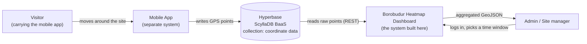
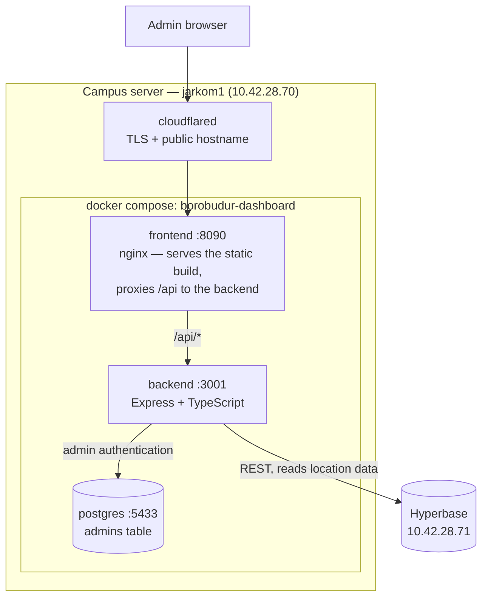
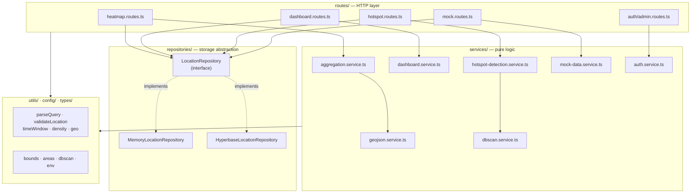
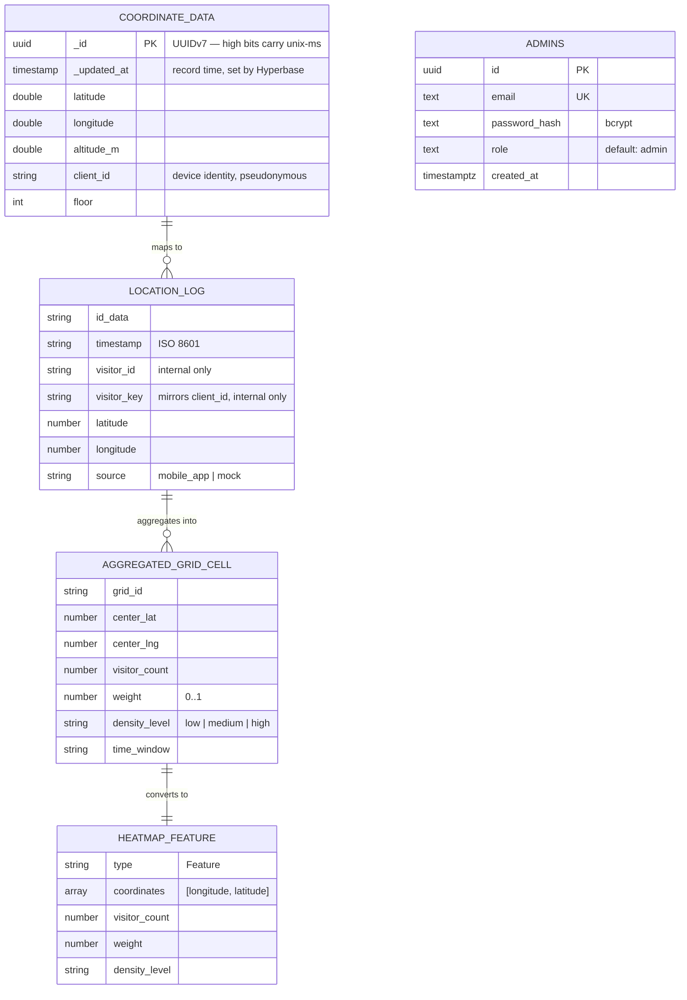
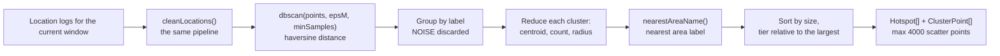
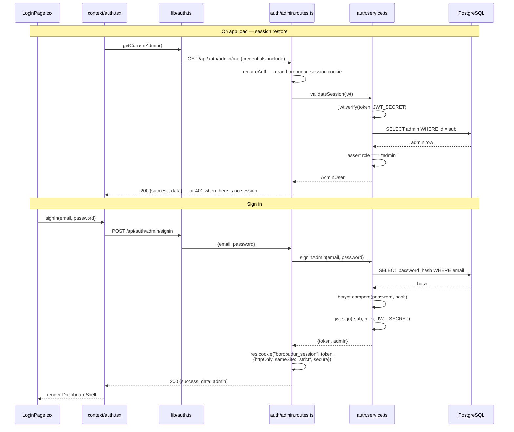
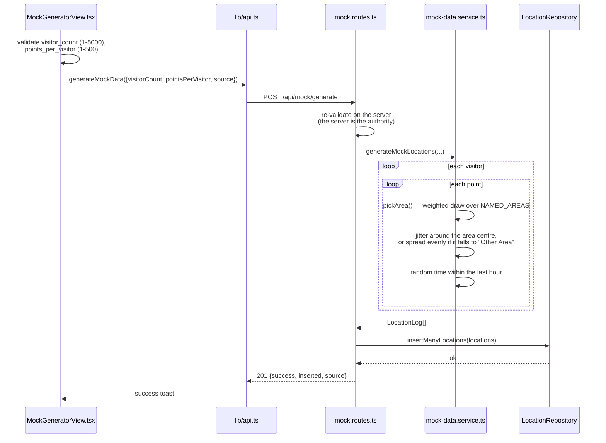

# Project Blueprint

This is the single document that covers the whole project: background, goals,
scope, design, implementation, testing, and final status. Deeper technical
documents stand on their own and are linked at the end of each chapter under
**See also**.

| | |
|---|---|
| **System name** | Borobudur Aggregated Heatmap Dashboard |
| **Repository** | <https://github.com/Hitchgernn/heatmap-dashboard> |
| **Documentation** | <https://hitchgernn.github.io/heatmap-dashboard/> |
| **System type** | Web-based geospatial monitoring dashboard |
| **Status** | Deployed and running on the campus server `jarkom1` |

---

## 1. Background and Problem Statement

### 1.1 Background

Borobudur is a world heritage site, and its visitors are not spread evenly —
neither across the grounds nor across the day. Some zones, the main stupa in
particular, are far busier than others at the same hour. Site managers need to
see that distribution in order to monitor it and to direct visitor flow.

An existing mobile app already records visitor positions: `latitude`,
`longitude`, `client_id`, and a recording time. Those records sit in
**Hyperbase**, a Backend-as-a-Service built on ScyllaDB. The raw data exists.
It just cannot be read as information.

### 1.2 Problem statement

1. Location data is stored as raw GPS points. There is no visual form a manager
   can read directly.
2. Streaming every raw point to the browser in real time is wasteful — heavy on
   the network, heavy on Leaflet — and it answers the wrong question. What is
   needed is the density pattern, not the individual points.
3. Broadcasting per-visitor points means broadcasting **individual movement
   traces**. That is a privacy problem, not merely a technical one.
4. Raw data contains invalid coordinates and coordinates far outside the temple
   grounds. Left unfiltered, they wreck the visualisation.

### 1.3 The approach taken

The system does not broadcast raw points. The backend fetches raw data from
Hyperbase, cleans it, drops points outside the site bounds, **aggregates the
rest onto a fixed grid**, and serves that aggregate as GeoJSON. The frontend
polls the GeoJSON over REST and draws it as a Leaflet heat layer.

The consequence is that privacy holds **by construction**, not by policy. Only
grid cells carrying point counts leave the backend. There is no `visitor_id` and
no per-person time ordering, so no individual trace can be reconstructed from an
API response.

---

## 2. Goals and Objectives

### 2.1 General goal

Build a web dashboard that shows visitor density at Borobudur in near real time
as an aggregated heatmap, without ever exposing individual location data.

### 2.2 Specific objectives

| No | Objective | Status |
|---|---|---|
| 1 | Display an interactive Leaflet map of the Borobudur area | Achieved |
| 2 | Fetch raw location data from Hyperbase through the backend | Achieved |
| 3 | Clean and validate raw `latitude` / `longitude` | Achieved |
| 4 | Filter out invalid and out-of-bounds coordinates | Achieved |
| 5 | Aggregate location data onto a grid | Achieved |
| 6 | Return aggregated GeoJSON from the backend | Achieved |
| 7 | Render a coloured heat layer in the frontend | Achieved |
| 8 | Provide time filters (5 min, 15 min, 1 hour, today, custom range) | Achieved |
| 9 | Refresh data periodically via REST polling | Achieved |
| 10 | Provide a mock data generator for testing the flow | Achieved |
| 11 | Test the full Hyperbase → backend → frontend flow with mock data | Achieved |
| 12 | Implement hotspot detection with DBSCAN | Achieved |
| 13 | Never expose `visitor_id` or individual movement history | Achieved |

These objectives come from the Main Goals list in the original PRD, re-verified
against the running code.

**See also:** [PRD.md](PRD.md) chapter 3.

---

## 3. Scope and Constraints

### 3.1 In scope

- A backend REST API with data cleaning, grid aggregation, GeoJSON
  transformation, dashboard summary, hotspot detection, and a mock generator.
- A frontend dashboard: Dashboard, Heatmap (Live and Timelapse modes), Hotspots,
  and Mock Generator pages.
- Admin authentication (a single role).
- Hotspot detection with DBSCAN.
- Docker Compose deployment on the campus server.

### 3.2 Out of scope (non-goals)

These were deliberately **not** built, and the decision is binding:

| Not built | Reason |
|---|---|
| Full raw GPS streaming | Contradicts the aggregate-and-privacy principle |
| WebSockets for every location update | REST polling is enough at a 30-second refresh rate |
| Deep learning | Outside the agreed ML scope |
| Crowd prediction, trajectory analysis, next-zone prediction, route recommendation | All of them require individual movement data |
| Structural damage prediction | Not this system's domain |
| Complex authentication and RBAC | There is exactly one role, `admin` |
| 3D map visualisation | Adds nothing to reading density |
| A production-scale monitoring stack | Overkill for a single-server deployment |
| Microservices | Overkill for the MVP scope |

### 3.3 Binding technical constraints

These are enforced in code, not merely by convention:

1. **GeoJSON coordinates are `[longitude, latitude]`**, never `[lat, lng]`.
   Leaflet uses the opposite order, so conversion happens only at the boundary
   (`frontend/src/lib/map.ts`) — never by reordering the GeoJSON itself.
2. **`visitor_id` never appears in any response.** The `HeatmapFeature` type has
   no field for it, so the type system guarantees the rule.
3. **Only aggregated data is served.**
4. **The frontend never contacts Hyperbase directly** — all data passes through
   the backend.
5. **No Next.js.** This is a client-side geospatial application; SSR and SEO are
   irrelevant.
6. **ML scope is limited to DBSCAN hotspot detection.**
7. **Geographic configuration is never hardcoded** outside
   `backend/src/config/`.

**See also:** [PRD.md](PRD.md) chapter 4.

---

## 4. Technology Choices and Rationale

The reasoning matters more than the list.

### 4.1 Frontend

| Technology | Version | Why |
|---|---|---|
| React | 18.3 | Declarative component model; mature Leaflet ecosystem |
| Vite | 6.0 | Fast dev server; the build output is static files nginx can serve directly |
| TypeScript | 5.6 | Data contracts (GeoJSON, `Hotspot`) are held by the compiler, not by discipline |
| Tailwind CSS | 4.0 | Consistent styling without a growing pile of separate CSS files |
| Leaflet + react-leaflet | 1.9 / 4.2 | Lightweight raster maps; `leaflet.heat` gives a ready heat layer |
| Recharts | 3.10 | Dashboard charts from data already fetched, with no extra request |

**Why not Next.js.** The workload here is Leaflet rendering, updating the heat
layer from GeoJSON, polling the API, and UI interaction — all client-side. SSR
and SEO add nothing, while React + Vite is simpler and produces static files
nginx serves as they are.

**Why Leaflet + OpenStreetMap.** No map token is needed, so there is no secret to
manage and no quota to exhaust. The basemap is deliberately
**theme-independent** — plain OpenStreetMap in both light and dark mode — so the
dashboard looks like the same place as the folium maps in the DBSCAN notebook.
Esri World Imagery satellite is available as an opt-in layer.

### 4.2 Backend

| Technology | Version | Why |
|---|---|---|
| Node.js + Express | 4.19 | Light, and sufficient for this REST and aggregation layer |
| TypeScript | 5.5 | Domain types shared with the frontend; the privacy rule is held by types |
| `pg` | 8.22 | PostgreSQL client for admin account storage |
| `bcryptjs` + `jsonwebtoken` | 3.0 / 9.0 | Password hashing and issuing our own session JWTs |
| `swagger-jsdoc` + `swagger-ui-express` | 6.3 / 5.0 | API docs generated from comments next to the route they describe |

**Why aggregate in the backend rather than the frontend.** Backend aggregation
keeps raw data on the server. If the frontend aggregated, the raw points would
have to be shipped first — and the entire premise of the project collapses.

### 4.3 Databases

The system uses **two** stores with different jobs:

| Store | Contents | Why |
|---|---|---|
| Hyperbase (ScyllaDB BaaS) | Location data (`coordinate data`) | Already the mobile app's store; the dashboard only reads |
| PostgreSQL (self-hosted) | Admin accounts (`admins` table) | Auth needs email uniqueness and simple relations; no reason to force that into a BaaS |

### 4.4 Machine learning

DBSCAN fits the shape of the problem. The number of clusters is not known in
advance (unlike K-Means, which demands *k*), clusters can be irregular and follow
the shape of the temple grounds, and isolated points genuinely should be treated
as *noise* rather than forced into a cluster.

Python, Pandas, and scikit-learn were used for **parameter exploration** in a
notebook. The implementation that runs in production was rewritten in TypeScript
inside the backend — chapter 11 explains why.

**See also:** [PRD.md](PRD.md) chapter 2.

---

## 5. Requirements Analysis

### 5.1 Functional requirements

| Code | Requirement |
|---|---|
| FR-01 | Display a map of the Borobudur area with an aggregated heat layer |
| FR-02 | Provide preset time windows: `5m`, `15m`, `1h`, `today`, `3d`, `7d`, `30d` |
| FR-03 | Accept custom `from`/`to` ranges up to 90 days |
| FR-04 | Refresh heatmap and summary data every 30 seconds |
| FR-05 | Show summary cards: estimated active visitors, total location points, busiest area, last update time |
| FR-06 | Run DBSCAN over the current time window and show clusters as hotspots |
| FR-07 | Let the user tune the DBSCAN parameters (`eps`, `minSamples`), with server-side bounds |
| FR-08 | Provide a Timelapse mode that replays a time range in fixed steps |
| FR-09 | Provide a mock data generator with a realistic distribution |
| FR-10 | Keep every data route behind a validated admin session |
| FR-11 | Provide a data-source switch between Mobile App and Mock |
| FR-12 | Offer the interface in English and Indonesian, with light/dark/system themes |

### 5.2 Non-functional requirements

| Code | Requirement | How it is met |
|---|---|---|
| NFR-01 | **Privacy** — individual data must not leave the server | Response types have no `visitor_id` field; output is grid cells |
| NFR-02 | **Freshness** — updates close to real time | 30-second REST polling; shortest window is 5 minutes |
| NFR-03 | **Bounded query cost** | Custom ranges capped at 90 days; Timelapse capped at 288 frames; hotspot scatter capped at 4000 points |
| NFR-04 | **Runs without credentials** | The `memory` driver seeds sample data, so the system runs with no Hyperbase access |
| NFR-05 | **Swappable data source** | Repository pattern: services depend only on the `LocationRepository` interface |
| NFR-06 | **Session security** | JWT inside an `httpOnly`, `SameSite=Strict` cookie |
| NFR-07 | **Simple deployment** | Three Docker Compose containers, one command |
| NFR-08 | **Consistent geographic configuration** | All bounds and grid size centralised in `config/bounds.ts` |

---

## 6. System Architecture

### 6.1 Context diagram

The system boundary and everything that interacts with it.



Note the direction of the arrow between Hyperbase and the system: **read only**.
The dashboard never writes to the mobile app's collection.

### 6.2 Container diagram



One fact drives many other decisions: **everything is one origin**. The browser
loads the app and calls `/api/...` on the same hostname; nginx in the frontend
container forwards that to the backend over the compose network. Because of
this, the session cookie can stay `SameSite=Strict`, and CORS never applies —
a same-origin request is not a cross-origin request.

### 6.3 Backend component diagram

The backend layers and the direction of their dependencies. Dependencies always
point inward; the `services` layer never imports a concrete repository.



### 6.4 Repository pattern

Services depend only on this interface:

```ts
getLocations(params): Promise<LocationLog[]>
insertLocation(location): Promise<void>
insertManyLocations(locations): Promise<void>
```

- `MemoryLocationRepository` — an in-process store that seeds about 97 sample
  points at boot. Selected with `REPOSITORY_DRIVER=memory` (the default). Because
  of it, the system can be run and assessed without Hyperbase credentials.
- `HyperbaseLocationRepository` — REST integration with Hyperbase: a server-side
  HTTP client, a cached service JWT, paginated reads, and one re-login retry on
  401/403. Selected with `REPOSITORY_DRIVER=hyperbase`.

Swapping drivers requires no change anywhere in the service layer. That is what
makes end-to-end testing possible without touching production data.

**See also:** [ARCHITECTURE.md](ARCHITECTURE.md), [HYPERBASE_INTEGRATION.md](HYPERBASE_INTEGRATION.md).

---

## 7. Data Design

### 7.1 Data model



The privacy boundary sits at the last transition. `LOCATION_LOG` has
`visitor_id` and `visitor_key`; `AGGREGATED_GRID_CELL` no longer does; and
`HEATMAP_FEATURE` has nowhere to put one. A leak is prevented by the shape of
the type, not by the care of whoever writes the next line of code.

### 7.2 The `coordinate data` collection (Hyperbase)

This collection belongs to the mobile app. The dashboard only reads it and must
not change its schema.

Two consequences follow from that schema:

1. **There is no dedicated `timestamp` column.** The recording time is
   `_updated_at`, which Hyperbase sets on insert.
2. **There is no `source` column.** Every row therefore maps to
   `source: "mobile_app"` on the backend side.

Time windows are expressed as **UUIDv7 `_id` ranges** rather than as filters on a
time column. Because the high bits of a UUIDv7 carry unix-ms, a query can use
`_id >= bound(from)` and `_id < bound(to)`. Pagination tightens the upper bound
using the last `_id` read.

### 7.3 The `admins` table (PostgreSQL)

```sql
CREATE TABLE IF NOT EXISTS admins (
  id            uuid PRIMARY KEY DEFAULT gen_random_uuid(),
  email         text NOT NULL UNIQUE,
  password_hash text NOT NULL,
  role          text NOT NULL DEFAULT 'admin',
  created_at    timestamptz NOT NULL DEFAULT now()
);
```

Only admin accounts live here. Location data stays in Hyperbase.

### 7.4 Geographic configuration

These values are centralised in `backend/src/config/` and must not be rewritten
anywhere else:

| Constant | Value | Note |
|---|---|---|
| `BOROBUDUR_BOUNDS` | lat −7.615 … −7.600, lng 110.195 … 110.215 | Points outside this box are dropped during cleaning |
| `BOROBUDUR_CENTER` | midpoint of the bounds | Map centre in the frontend |
| `GRID_SIZE` | 0.0001 degrees (about 11 metres) | Aggregation grid cell size |

The named areas in `config/areas.ts` serve two purposes at once — the mock
generator (so its distribution is realistic) and the `most_crowded_area` label:

| Area | Weight | Spread |
|---|---|---|
| Main Stupa | 45% | 0.0006 |
| Entrance Area | 25% | 0.0006 |
| East Stairs | 15% | 0.0005 |
| West Area | 10% | 0.0005 |
| Other Area (remainder) | about 5% | spread evenly inside the bounds |

**See also:** [HYPERBASE_SCHEMA.md](HYPERBASE_SCHEMA.md), [API.md](API.md) chapter 10.

---

## 8. API Design

### 8.1 Endpoint list

| Method | Path | Purpose | Auth |
|---|---|---|---|
| `GET` | `/health` | Health check for infrastructure | No |
| `GET` | `/api/docs` | Swagger UI | No |
| `GET` | `/api/docs.json` | Raw OpenAPI spec | No |
| `POST` | `/api/auth/admin/signin` | Sign in, issues the session cookie | No |
| `POST` | `/api/auth/admin/signup` | Register an admin, gated by `ADMIN_REGISTRATION_SECRET` | No |
| `POST` | `/api/auth/admin/logout` | Clear the session cookie | No |
| `GET` | `/api/auth/admin/me` | Return the admin of the current session | Yes |
| `GET` | `/api/heatmap/aggregate` | Aggregated GeoJSON | Yes |
| `GET` | `/api/dashboard/summary` | Summary statistics | Yes |
| `GET` | `/api/hotspots` | Live DBSCAN clusters | Yes |
| `POST` | `/api/mock/location` | Insert one mock point | Yes |
| `POST` | `/api/mock/generate` | Generate mock data in bulk | Yes |
| `GET` | `/api/debug/hyperbase` | Verify Hyperbase authentication — **temporary** | Yes |

`GET /api/debug/hyperbase` is marked temporary in the code and should be removed
before long-term production use.

### 8.2 Time window parameters

Every data route uses one shared validation function, `parseLocationQuery()` in
`utils/parseQuery.ts`. No route may write its own. This has gone wrong before: a
stale copy of `VALID_WINDOWS` once lived in the heatmap route, and the compiler
could not catch it because a subset array still satisfies `TimeWindowPreset[]`.

| Parameter | Values | Note |
|---|---|---|
| `window` | `5m`, `15m`, `1h`, `today`, `3d`, `7d`, `30d` | Time window presets |
| `from` / `to` | ISO 8601 | Custom range; requires `from < to` and a span of 90 days or less |
| `source` | `mobile_app`, `mock`, `all` | Data source filter |
| `eps` | 2 … 200 (default 8) | DBSCAN neighbourhood radius, in metres |
| `minSamples` | 2 … 50 (default 5) | Minimum neighbours to seed a cluster |

### 8.3 Response shapes

There are **two** response styles, and the difference is deliberate:

1. **GeoJSON endpoints** (`/api/heatmap/aggregate`) return raw GeoJSON with no
   wrapper, so they stay spec-compliant and any mapping library can consume them.
2. **Everything else** uses the standard envelope:

```json
{ "success": true, "data": { } }
{ "success": false, "error": { "code": "VALIDATION_ERROR", "message": "..." } }
```

Error codes in use: `VALIDATION_ERROR`, `INVALID_TIME_WINDOW`,
`INVALID_COORDINATE`, `NOT_FOUND`, `UNAUTHORIZED`, `FORBIDDEN`, `AUTH_FAILED`,
`SIGNUP_FAILED`, `REGISTRATION_DISABLED`, `INTERNAL_SERVER_ERROR`.

### 8.4 Interactive API documentation

Swagger UI is served at `GET /api/docs`. The spec is built by `swagger-jsdoc`
from `@openapi` comments above each handler, so the documentation lives next to
the code it describes. Swagger is mounted **before** the `requireAuth`-gated
routers, which makes the docs page public while every endpoint it documents stays
closed — "Try it out" only works once you hold a session cookie.

**See also:** [API.md](API.md) — that document is the binding contract.

---

## 9. Core Process Flows

### 9.1 The aggregation pipeline

This is the heart of the system. Every heatmap request follows this path.

```mermaid
flowchart LR
    A["HTTP request<br/>window / from / to / source"]
    B["parseLocationQuery()<br/>parameter validation"]
    C["LocationRepository<br/>.getLocations()"]
    D["cleanLocations()<br/>validate lat/lng/time"]
    E["Filter BOROBUDUR_BOUNDS<br/>out-of-area points dropped"]
    F["snapToGrid()<br/>GRID_SIZE = 0.0001°"]
    G["Count points per cell"]
    H["Normalise weight<br/>count / maxCount"]
    I["densityFromWeight()<br/>low / medium / high"]
    J["toFeatureCollection()<br/>[longitude, latitude]"]
    K["GeoJSON<br/>no visitor_id"]

    A --> B --> C --> D --> E --> F --> G --> H --> I --> J --> K
```



Three details determine the result:

- **Cleaning and bounds filtering happen in one place**
  (`utils/validateLocation.ts`), reused by the heatmap, the dashboard summary,
  and hotspot detection alike. All three therefore always work on exactly the
  same set of points.
- **`weight` is relative, not absolute.** It is `count / maxCount` within that
  time window, so some cell always reads 1.0. The heatmap shows *where* it is
  busiest, not what the absolute density is.
- **Density thresholds:** `low` < 0.33 ≤ `medium` < 0.66 ≤ `high`.

### 9.2 Hotspot detection (DBSCAN)



### 9.3 Admin authentication flow



Passwords are never stored in their original form, and the token is never
readable by JavaScript because the cookie is `httpOnly`.

### 9.4 Mock data generator



Two things make this generator useful as a test tool:

- **Its distribution is uneven.** The weighted draw over `NAMED_AREAS` produces
  clumps that resemble real conditions, so DBSCAN actually has something to
  cluster.
- **Mock data goes through the same `LocationRepository` interface** as
  production data, and therefore through the exact same aggregation pipeline.
  That is what objective 11 means — testing the full flow, not a special path.

**See also:** [DATA_FLOWS.md](DATA_FLOWS.md).

---

## 10. Interface Design

### 10.1 Page structure

`Sidebar.tsx` handles navigation. The active page is stored in `localStorage`,
so a refresh does not move the user.

| Page | Contents |
|---|---|
| **Dashboard** | Summary cards, heatmap with hotspot markers, two Recharts charts (bars per area, donut per density tier), hotspot table |
| **Heatmap** | Full map with Live and Timelapse modes; no hotspot markers |
| **Hotspots** | DBSCAN clusters with `eps` / `minSamples` controls, a table, and detail cards |
| **Mock Generator** | The mock data generation form |
| **Settings** | A modal, not a page — theme picker, language picker, and logout |

### 10.2 Timelapse mode

Timelapse replays a chosen date or range in fixed steps (5 minutes to 1 hour).
Each frame is one absolute time slice fetched through the same endpoint.
`hooks/useTimelapse.ts` caches frames as indexed promises — so nothing is
fetched twice, and a failed frame evicts itself so it can be retried — prefetches
3 frames ahead, and auto-plays at 800 ms per frame. Frames are capped at 288.

### 10.3 The map

- The map is created **exactly once**. `HeatLayer` updates its points in place
  through `setLatLngs` rather than recreating the layer on every poll.
- The basemap is theme-independent: standard OpenStreetMap, with Esri satellite
  imagery as an opt-in choice in the layer picker.
- **Leaflet takes `[latitude, longitude]` while GeoJSON uses
  `[longitude, latitude]`.** The conversion lives in `lib/map.ts`
  `toHeatPoints()`.

### 10.4 Typography

Three typefaces with three roles, wired as Tailwind v4 theme variables:
**Instrument Serif** for the wordmark, page headings, and prominent named
values; **DM Sans** for anything read as a sentence (the document default);
**Fira Code** for all numbers, metrics, IDs, status-pill text, and small
uppercase labels.

### 10.5 Theme and language

Light / dark / system themes are stored in `localStorage` and applied through a
`.dark` class on the `<html>` element. An inline script in `index.html` applies
the stored theme and language **before** React mounts, so there is no flash.

The interface is available in English and Indonesian. Section and product names
(Dashboard, Heatmap, Hotspots, Borobudur, Settings, Mock Generator) stay English
in both locales — they read as proper nouns and sound wrong when translated.

---

## 11. Machine Learning Module — Hotspot Detection

### 11.1 The algorithm

DBSCAN (*Density-Based Spatial Clustering of Applications with Noise*) works from
two parameters:

- **`eps`** — the neighbourhood radius. Two points closer than this are
  neighbours. It is expressed in **metres**, with distance computed by the
  haversine formula rather than Euclidean distance over degrees.
- **`minSamples`** — the minimum number of neighbours needed for a point to seed
  a cluster. Groups smaller than this become *noise*.

Defaults: `eps = 8` metres, `minSamples = 5`. Both come from tuning in the
exploration notebook. Users can change them through query parameters, and the
server clamps them to `eps` 2–200 and `minSamples` 2–50 — so an oversized `eps`
cannot melt everything into one blob, and an oversized `minSamples` cannot reject
everything.

### 11.2 Implementation

This needs stating plainly, because it differs from the original design:
**DBSCAN runs directly inside the backend, written in TypeScript.**

| File | Role |
|---|---|
| `backend/src/services/dbscan.service.ts` | The DBSCAN implementation |
| `backend/src/services/hotspot-detection.service.ts` | Reduces clusters to aggregates |
| `backend/src/config/dbscan.ts` | Default parameters and clamping bounds |
| `backend/src/utils/geo.ts` | `haversineMeters()` |

The original design placed DBSCAN in a Python script running outside the request
path, writing results to `ml/output/hotspots.json` for the backend to read. That
was abandoned because the results could never follow the time window the user was
actually looking at — a precomputed file always describes a past snapshot, while
the user changes windows and parameters interactively. Running DBSCAN live keeps
the clusters consistent with the heatmap on the same screen.

`ml/notebooks/dbscan_exploration.ipynb` (Python, Pandas, scikit-learn, folium) is
kept as a record of the parameter exploration — it is where the default `eps` and
`minSamples` were decided. It is **not** a runtime dependency; nothing in the
system reads it while running.

### 11.3 Output

Each cluster is reduced to these aggregates, and only the aggregates leave the
server:

| Field | Meaning |
|---|---|
| `cluster_id` | Cluster identifier within one result set |
| `center_lat` / `center_lng` | Cluster centroid |
| `total_points` | Number of member points |
| `label` | Nearest area name (`nearestAreaName()`) |
| `density_level` | Tier relative to the largest cluster |
| `radius_m` | Distance from the centroid to the furthest member |
| `share` | Fraction (0..1) of all clustered points |

The scatter points (`ClusterPoint`) sent for visualisation carry only position
and density tier — no `visitor_id`, no timestamp, and no ordering. That last
absence matters: without ordering, a set of points is not a trajectory.

---

## 12. Security and Privacy

### 12.1 Privacy by construction

Four layers reinforce each other:

1. **The response types have nowhere to put a `visitor_id`.** `HeatmapFeature`
   and `Hotspot` do not define the field, so a leak fails to compile rather than
   slipping through silently.
2. **Output is always aggregate** — grid cells or clusters, never per-visitor
   points.
3. **Distinct visitor counting happens inside the server**, and only the
   cardinality (`estimated_active_visitors`) leaves it.
4. **Hotspot scatter points are unordered**, so they cannot be reassembled into
   a path.

### 12.2 Authentication and authorisation

| Aspect | Implementation |
|---|---|
| Password storage | `bcryptjs`; never stored as plain text |
| Session | A JWT this system issues itself, 24-hour default lifetime |
| Token transport | The `borobudur_session` cookie: `httpOnly`, `SameSite=Strict`, `Secure` in production |
| Route protection | `requireAuth` on `/api/heatmap`, `/api/dashboard`, `/api/mock`, `/api/hotspots`, `/api/debug` |
| Role authorisation | `validateSession` reloads the admin row and requires `role === "admin"` |
| Registration | `POST /api/auth/admin/signup`, gated by `ADMIN_REGISTRATION_SECRET` |

An `httpOnly` cookie cannot be read by JavaScript, so XSS cannot steal the token.
`SameSite=Strict` is possible precisely because this deployment is single-origin,
and it is the strongest setting available.

### 12.3 Things worth stating honestly

- `GET /api/debug/hyperbase` is still mounted. It does not leak the JWT, but it
  is marked temporary in the code and should be removed.
- When serving over plain HTTP (a LAN demo, for instance), `COOKIE_SECURE` must
  be set to `false`, because browsers discard `Secure` cookies on `http://`. The
  symptom is misleading: login appears to succeed, then every later request
  answers "Authentication required".

---

## 13. Deployment and Operations

### 13.1 Topology

The deployment runs on the campus server `jarkom1` (`10.42.28.70`) using Docker
Compose with three containers.

```
Browser
   │
   └── https://dashboard.your-domain.ac.id     jarkom1 (10.42.28.70)
                                                  │
                                                  ├── cloudflared (TLS + public hostname)
                                                  │      └── to 127.0.0.1:8090
                                                  │
                                                  └── docker compose "borobudur-dashboard"
                                                         ├── frontend  :8090 → loopback
                                                         │     ├── serves the dashboard build
                                                         │     └── proxies /api → backend:3001
                                                         ├── backend   :3001 → loopback
                                                         └── postgres  :5433 → loopback
                                                                │
                                                       Hyperbase (same network, over REST)
```

### 13.2 Operational decisions and their reasons

| Decision | Reason |
|---|---|
| One origin for everything | The cookie stays `SameSite=Strict`; CORS never applies |
| All ports bound to `127.0.0.1` by default | Only the frontend port needs opening; backend and database are unreachable from outside the host |
| Cloudflare Tunnel for public access | No public IP needed, no inbound port opened, no certificate to manage |
| `name: borobudur-dashboard` in compose | The server is shared; naming prevents collisions with other projects' containers |
| `PG_PUBLISH_PORT` defaults to 5433, not 5432 | Port 5432 is usually already taken by another Postgres on a shared host |
| Schema applied automatically on first init | Via `/docker-entrypoint-initdb.d` |

### 13.3 Operational warning

> **Warning — commands never to run on a shared server.**
> `docker system prune`, `docker volume prune`, and `docker image prune -a`
> operate host-wide and will destroy other people's projects. The same goes for
> `docker compose down -v` — the `-v` flag deletes the volume holding the admin
> accounts.

### 13.4 Key environment variables

| Variable | Purpose |
|---|---|
| `REPOSITORY_DRIVER` | `memory` (default) or `hyperbase` |
| `HYPERBASE_BASE_URL`, `HYPERBASE_PROJECT_ID`, `HYPERBASE_LOCATION_COLLECTION_ID`, `HYPERBASE_TOKEN_ID`, `HYPERBASE_TOKEN_SECRET` | Access to the location data collection |
| `DATABASE_URL`, or `PGHOST`/`PGPORT`/`PGUSER`/`PGPASSWORD`/`PGDATABASE` | PostgreSQL connection |
| `JWT_SECRET`, `JWT_EXPIRES_IN` | Session token issuing and lifetime |
| `ADMIN_REGISTRATION_SECRET` | Gate on the admin registration endpoint |
| `COOKIE_SECRET`, `COOKIE_MAX_AGE_MS`, `COOKIE_SECURE` | Session cookie behaviour |
| `FRONTEND_BIND`, `FRONTEND_PUBLISH_PORT`, `BACKEND_PUBLISH_PORT`, `PG_PUBLISH_PORT` | Port binding and publishing |
| `VITE_API_BASE_URL` (frontend) | API base URL; behind nginx, just `/api` |

`config/env.ts` is the **only** place that reads `process.env`, and it calls
`import "dotenv/config"` on its first line. Without that, the `.env` file is
never read and the driver silently falls back to `memory`.

**See also:** [DEPLOYMENT.md](DEPLOYMENT.md).

---

## 14. Testing and Verification

### 14.1 Continuous integration

`.github/workflows/ci.yml` runs on every push to `master` and every pull request,
with three jobs:

| Job | Contents |
|---|---|
| **Backend** | `npm ci`, `npm run typecheck`, `npm run build` |
| **Frontend** | `npm ci`, `npm run build` (that is `tsc --noEmit && vite build`, so type checking is included) |
| **Docker** | Builds both images, then verifies that `dist/db/schema.sql` actually reaches the backend image and that the frontend bundle does not contain `localhost:3001` |

The Docker job catches breakage the backend job cannot see. `schema.sql` is one
example: tsc does not copy non-TypeScript files into `dist/`, so an oversight in
the `Dockerfile` would only fail when the container runs, not when it builds. The
`localhost:3001` check is another — if the `VITE_API_BASE_URL` build arg fails to
reach Vite, the bundle silently falls back to `localhost:3001` and every user's
browser calls their own machine.

### 14.2 Local verification

```bash
# Backend
cd backend && npm run typecheck   # tsc --noEmit
cd backend && npm run build       # tsc -> dist/

# Frontend
cd frontend && npm run build      # tsc --noEmit && vite build
```

Neither package has a lint step; `build` and `typecheck` are the verification
gates.

### 14.3 Manual post-deployment verification

Taken from [DEPLOYMENT.md](DEPLOYMENT.md) chapter 6:

1. Containers are up and `postgres` reports healthy.
2. `GET /health` answers `{"status":"ok"}`.
3. Admin registration succeeds via `POST /api/auth/admin/signup`.
4. Login returns a session cookie, and `GET /api/auth/admin/me` recognises it.
5. `GET /api/heatmap/aggregate` returns GeoJSON containing features.
6. The dashboard loads and the heatmap draws in the browser.

### 14.4 Automated test status — stated plainly

**There are no automated tests in either package.** The `npm test` script exists
in the backend (`node --test` with `tsx`), but no test file does. The frontend
has no test runner.

Verification currently rests on three things: TypeScript type checking, CI that
builds the images and checks their runtime completeness, and manual end-to-end
testing with the mock data generator. That is enough to catch structural
breakage, but it does not catch logic regressions. Adding unit tests for
`aggregation.service`, `validateLocation`, `parseQuery`, and `dbscan.service` is
the most valuable next piece of work — all four are pure functions, so they are
the easiest to test.

---

## 15. Results and Implementation Status

| Component | Status | Note |
|---|---|---|
| Backend REST API | **Done** | Six data endpoints plus admin authentication |
| Grid aggregation pipeline | **Done** | Cleaning, bounds filtering, grid snapping, normalisation, labelling |
| GeoJSON transformation | **Done** | `[longitude, latitude]`, no `visitor_id` |
| Hyperbase integration | **Done** | Read-only over the `coordinate data` collection, time windows via UUIDv7 bounds |
| Memory repository | **Done** | Seeds about 97 sample points at boot |
| Admin authentication | **Done** | PostgreSQL, bcrypt, JWT in an `httpOnly` cookie |
| API documentation (Swagger) | **Done** | `/api/docs` and `/api/docs.json` |
| Frontend dashboard | **Done** | Four pages, light/dark/system themes, English/Indonesian i18n |
| Timelapse mode | **Done** | Frame cache, prefetch, auto-play, 288-frame cap |
| DBSCAN hotspot detection | **Done** | Runs live in the backend, parameters tunable |
| Dashboard charts | **Done** | Bar and donut charts from already-fetched data |
| Mock data generator | **Done** | Weighted distribution over named areas |
| Docker deployment | **Done** | Three containers, running on `jarkom1` |
| CI | **Done** | Backend, frontend, and image verification |
| `DELETE /api/mock/clear` | **Not built** | Was listed as optional in an early draft of the API contract; never implemented, and no longer documented as an endpoint |
| Automated tests | **Not built** | See chapter 14.4 |
| Hyperbase debug route | **Should be removed** | `GET /api/debug/hyperbase` is marked temporary |

The last three rows are listed on purpose. They are known gaps, not oversights.

---

## 16. Further Development

Ordered by value against effort:

1. **Automated tests for the pure functions** — `aggregation.service`,
   `validateLocation`, `parseQuery`, `dbscan.service`. Highest value for the
   lowest effort, since none of them has side effects.
2. **Remove `GET /api/debug/hyperbase`** before long-term production use.
3. **Move aggregation into the database.** Already measured at roughly 6.7×
   faster with identical output, but deferred because the endpoint it needs is
   not available on the instance the current configuration points at.
4. **Implement `DELETE /api/mock/clear`** if clearing mock data turns out to be
   needed.
5. **Add integration tests for the authentication flow**, since that is the path
   that most often breaks when the environment changes.

**See also:** [FURTHER_DEVELOPMENT.md](FURTHER_DEVELOPMENT.md).

---

## 17. Appendices

### 17.1 Glossary

| Term | Meaning |
|---|---|
| **Grid aggregation** | Dividing the area into fixed-size cells, then counting the points in each |
| **BaaS** | Backend-as-a-Service — a managed database reached over REST; here, Hyperbase |
| **DBSCAN** | A density-based clustering algorithm; it does not require the cluster count up front and it recognises noise |
| **`eps`** | The DBSCAN neighbourhood radius, in metres |
| **GeoJSON** | The standard geospatial data format; its coordinates are ordered `[longitude, latitude]` |
| **Haversine** | The formula for distance between two points on a sphere |
| **Heatmap** | A density visualisation using a colour gradient |
| **`minSamples`** | The minimum neighbours needed to seed a DBSCAN cluster |
| **Noise** | A point DBSCAN assigns to no cluster |
| **Polling** | Periodic fetching by the client, as an alternative to server push |
| **ScyllaDB** | A wide-column NoSQL database, Cassandra-compatible |
| **UUIDv7** | A UUID whose high bits carry a unix-ms timestamp, making it time-ordered |
| **`weight`** | Normalised cell density (0..1), relative to the busiest cell in the same time window |

### 17.2 Related documentation

Current:

| Document | Contents |
|---|---|
| [ARCHITECTURE.md](ARCHITECTURE.md) | Architecture summary |
| [API.md](API.md) | The binding endpoint contract |
| [DATA_FLOWS.md](DATA_FLOWS.md) | Sequence diagrams for the mock generator and authentication |
| [HYPERBASE_SCHEMA.md](HYPERBASE_SCHEMA.md) | The binding Hyperbase data model |
| [DEPLOYMENT.md](DEPLOYMENT.md) | Topology, environment template, verification |
| [FURTHER_DEVELOPMENT.md](FURTHER_DEVELOPMENT.md) | Post-deployment work |

Archived — kept for history, each one banner-marked so it is not mistaken for a
current reference:

| Document | Why archived |
|---|---|
| [PRD.md](PRD.md) | The original brief; the system has drifted from it |
| [IMPLEMENTATION_PLAN.md](IMPLEMENTATION_PLAN.md) | All four workstreams shipped |
| [HYPERBASE_INTEGRATION.md](HYPERBASE_INTEGRATION.md) | Its `location_logs` schema was replaced by the `coordinate data` collection |
| [HYPERBASE_AUTH_INTEGRATION.md](HYPERBASE_AUTH_INTEGRATION.md) | Auth through Hyperbase, replaced by PostgreSQL storage |

### 17.3 Image versions of the diagrams

Every Mermaid diagram in this document is also available as a PNG in
`docs/assets/diagrams/`, for pasting into a Word or PDF report. The `.mmd`
sources are in `docs/assets/diagrams/src/` and can be rebuilt with:

```bash
bash scripts/render-diagrams.sh
```
