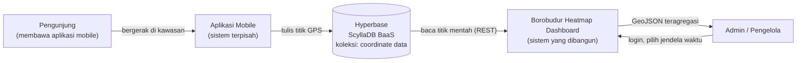
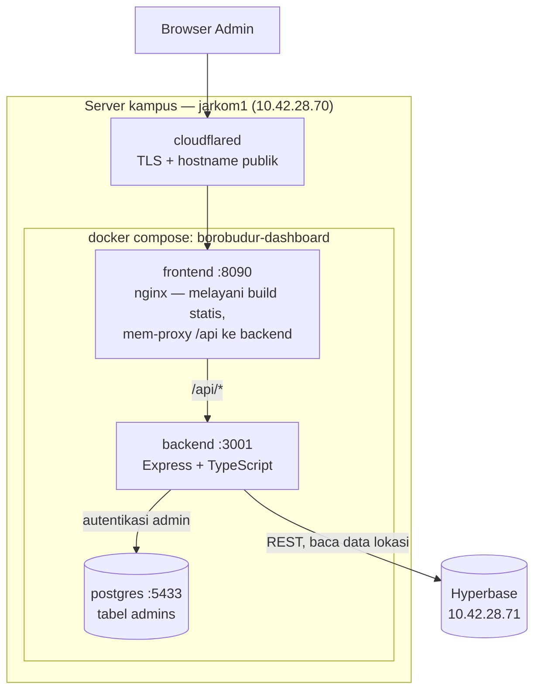
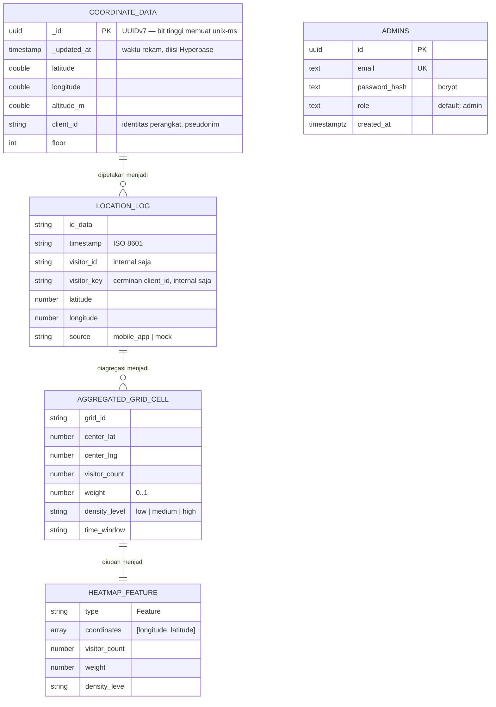
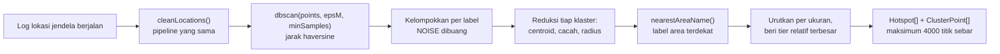
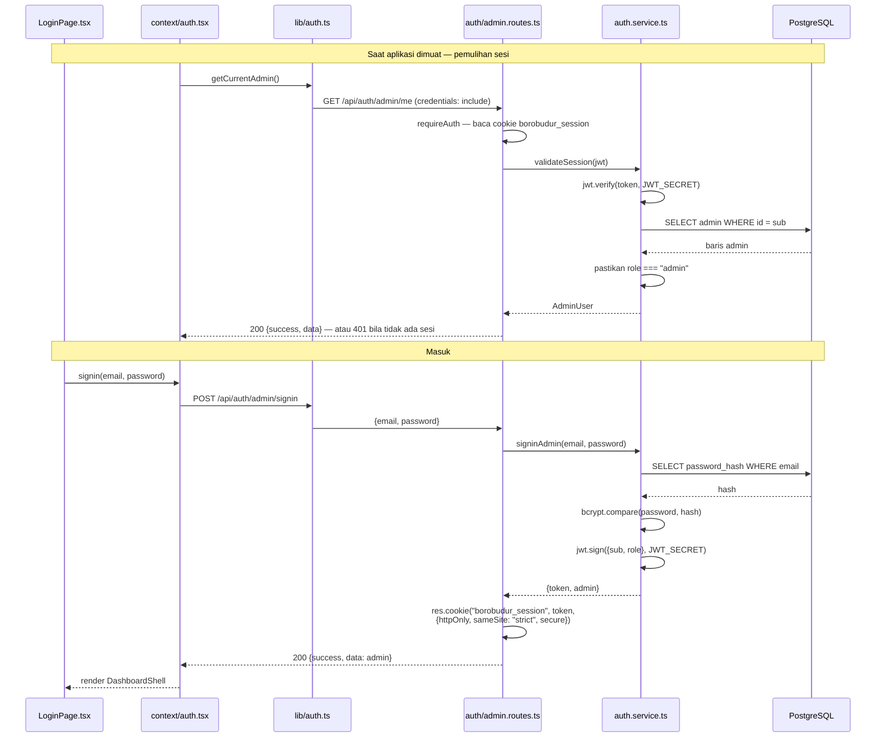

# Blueprint Proyek

# Borobudur Aggregated Heatmap Dashboard

Dokumen ini adalah blueprint proyek: satu naskah yang merangkum latar belakang,
tujuan, ruang lingkup, rancangan, implementasi, pengujian, dan status akhir
sistem. Dokumen teknis yang lebih dalam tetap berdiri sendiri dan dirujuk di
akhir tiap bab lewat baris **Rujukan detail**.

Dokumen teknis rujukan ditulis dalam bahasa Inggris. Istilah teknis, nama kode,
nama endpoint, dan pesan galat sengaja **tidak** diterjemahkan agar cocok persis
dengan yang ada di dalam kode.

| | |
|---|---|
| **Nama sistem** | Borobudur Aggregated Heatmap Dashboard |
| **Repositori** | <https://github.com/Hitchgernn/heatmap-dashboard> |
| **Dokumentasi** | <https://hitchgernn.github.io/heatmap-dashboard/> |
| **Jenis sistem** | Dashboard monitoring geospasial berbasis web |
| **Status** | Berjalan (deployed) di server kampus `jarkom1` |

---

## 1. Latar Belakang dan Rumusan Masalah

### 1.1 Latar belakang

Candi Borobudur adalah situs warisan dunia dengan kepadatan pengunjung yang
tidak merata, baik secara ruang maupun waktu. Sebagian zona (misalnya area stupa
utama) jauh lebih padat daripada zona lain pada jam yang sama. Pengelola
membutuhkan gambaran kepadatan itu untuk keperluan pemantauan dan pengaturan
alur pengunjung.

Sebuah aplikasi mobile yang sudah ada merekam data lokasi pengunjung berupa
`latitude`, `longitude`, `client_id`, dan waktu perekaman. Data tersebut
tersimpan di **Hyperbase**, sebuah Backend-as-a-Service berbasis ScyllaDB.
Data mentah itu sudah ada, tetapi belum bisa dibaca sebagai informasi.

### 1.2 Rumusan masalah

1. Data lokasi tersimpan sebagai titik GPS mentah — tidak ada representasi
   visual yang bisa langsung dibaca pengelola.
2. Mengirim setiap titik GPS mentah ke browser secara real-time tidak efisien:
   beban jaringan besar, beban rendering Leaflet berat, dan nilainya rendah
   karena yang dibutuhkan adalah pola kepadatan, bukan titik individual.
3. Menyiarkan titik mentah per pengunjung berarti menyiarkan **jejak pergerakan
   individu**. Itu masalah privasi, bukan sekadar masalah teknis.
4. Data mentah mengandung koordinat tidak valid dan koordinat di luar kawasan
   candi yang akan merusak visualisasi jika tidak disaring.

### 1.3 Pendekatan yang diambil

Sistem tidak menyiarkan titik mentah. Backend mengambil data mentah dari
Hyperbase, membersihkannya, menyaring titik di luar batas kawasan,
**mengagregasinya ke dalam grid tetap**, lalu menyajikan hasil agregat itu
sebagai GeoJSON. Frontend melakukan *polling* REST atas GeoJSON tersebut dan
menggambarnya sebagai layer heatmap Leaflet.

Konsekuensinya, privasi terjaga **secara konstruksi**, bukan secara kebijakan:
yang keluar dari backend hanyalah sel grid berisi cacah titik. Tidak ada
`visitor_id`, tidak ada urutan waktu per orang, sehingga jejak individu tidak
dapat direkonstruksi dari respons API.

---

## 2. Tujuan dan Sasaran

### 2.1 Tujuan umum

Membangun dashboard web yang memvisualisasikan kepadatan pengunjung Candi
Borobudur secara *near real-time* dalam bentuk heatmap teragregasi, tanpa pernah
mengekspos data lokasi individual.

### 2.2 Sasaran spesifik

| No | Sasaran | Status |
|---|---|---|
| 1 | Menampilkan peta interaktif kawasan Borobudur menggunakan Leaflet | Tercapai |
| 2 | Mengambil data lokasi mentah dari Hyperbase melalui backend | Tercapai |
| 3 | Membersihkan dan memvalidasi `latitude` / `longitude` mentah | Tercapai |
| 4 | Menyaring koordinat tidak valid atau di luar batas kawasan | Tercapai |
| 5 | Mengagregasi data lokasi berdasarkan grid | Tercapai |
| 6 | Mengembalikan GeoJSON teragregasi dari backend | Tercapai |
| 7 | Menampilkan layer heatmap berwarna di frontend | Tercapai |
| 8 | Menyediakan filter waktu (5 menit, 15 menit, 1 jam, hari ini, rentang kustom) | Tercapai |
| 9 | Menyegarkan data secara berkala lewat *polling* REST | Tercapai |
| 10 | Menyediakan generator data tiruan (*mock*) untuk pengujian alur | Tercapai |
| 11 | Menguji alur penuh Hyperbase → backend → frontend dengan data tiruan | Tercapai |
| 12 | Mengimplementasikan Hotspot Detection dengan DBSCAN | Tercapai |
| 13 | Tidak pernah mengekspos `visitor_id` atau riwayat pergerakan individu | Tercapai |

Sasaran ini diambil langsung dari daftar *Main Goals* pada PRD dan diverifikasi
ulang terhadap kode yang berjalan.

**Rujukan detail:** [PRD.md](PRD.md) bab 3.

---

## 3. Ruang Lingkup dan Batasan

### 3.1 Termasuk dalam ruang lingkup

- Backend REST API dengan pembersihan data, agregasi grid, transformasi GeoJSON,
  ringkasan dashboard, deteksi hotspot, dan generator data tiruan.
- Frontend dashboard: halaman Dashboard, Heatmap (mode Live dan Timelapse),
  Hotspots, dan Mock Generator.
- Autentikasi admin (satu peran saja).
- Deteksi hotspot dengan DBSCAN.
- Deployment berbasis Docker Compose di server kampus.

### 3.2 Di luar ruang lingkup (Non-Goals)

Berikut sengaja **tidak** dibangun, dan keputusan ini bersifat mengikat:

| Tidak dibangun | Alasan |
|---|---|
| Streaming GPS mentah secara penuh | Bertentangan dengan prinsip agregat dan privasi |
| WebSocket untuk tiap pembaruan lokasi | *Polling* REST cukup untuk laju pembaruan 30 detik |
| Deep learning | Di luar lingkup ML yang disepakati |
| Prediksi kepadatan, analisis trajektori, prediksi zona berikutnya, rekomendasi rute | Semuanya membutuhkan data pergerakan individual |
| Prediksi kerusakan struktur | Bukan domain sistem ini |
| Autentikasi kompleks dan RBAC | Hanya ada satu peran, yaitu `admin` |
| Visualisasi peta 3D | Tidak menambah nilai untuk pembacaan kepadatan |
| *Monitoring stack* skala produksi | Berlebihan untuk deployment satu server |
| Arsitektur microservices | Berlebihan untuk cakupan MVP |

### 3.3 Batasan teknis yang mengikat

Batasan ini dijaga di tingkat kode, bukan sekadar konvensi:

1. **Koordinat GeoJSON adalah `[longitude, latitude]`**, bukan `[lat, lng]`.
   Leaflet menggunakan urutan kebalikannya, sehingga konversi hanya boleh
   dilakukan di batas antarmuka (`frontend/src/lib/map.ts`), bukan dengan
   membalik GeoJSON-nya.
2. **`visitor_id` tidak pernah muncul di respons apa pun.** Tipe
   `HeatmapFeature` tidak memiliki *field* untuk itu, sehingga aturan ini
   dijamin oleh sistem tipe.
3. **Hanya data teragregasi yang disajikan.**
4. **Frontend tidak pernah menghubungi Hyperbase secara langsung** — semua data
   melewati backend.
5. **Tidak menggunakan Next.js.** Ini aplikasi geospasial sisi klien; SSR dan SEO
   tidak relevan.
6. **Lingkup ML terbatas pada deteksi hotspot dengan DBSCAN.**
7. **Konfigurasi geografis tidak boleh ditulis langsung (*hardcode*)** di luar
   `backend/src/config/`.

**Rujukan detail:** [PRD.md](PRD.md) bab 4.

---

## 4. Justifikasi Pemilihan Teknologi

Tabel berikut menyatakan pilihan beserta alasannya. Alasan lebih penting daripada
daftar teknologinya.

### 4.1 Frontend

| Teknologi | Versi | Alasan pemilihan |
|---|---|---|
| React | 18.3 | Model komponen deklaratif; ekosistem Leaflet matang |
| Vite | 6.0 | *Dev server* cepat, keluaran *build* berupa berkas statis yang mudah dilayani nginx |
| TypeScript | 5.6 | Kontrak data (GeoJSON, `Hotspot`) dijaga kompilator, bukan oleh disiplin manual |
| Tailwind CSS | 4.0 | Penataan konsisten tanpa berkas CSS terpisah yang menumpuk |
| Leaflet + react-leaflet | 1.9 / 4.2 | Peta raster ringan; `leaflet.heat` memberi layer heatmap siap pakai |
| Recharts | 3.10 | Grafik dashboard dari data yang sudah diambil, tanpa permintaan tambahan |

**Mengapa bukan Next.js.** Beban kerja utama aplikasi ini adalah rendering
Leaflet, pembaruan layer heat dari GeoJSON, *polling* API, dan interaksi UI —
semuanya di sisi klien. SSR dan SEO tidak memberi nilai, sementara React + Vite
lebih sederhana dan menghasilkan berkas statis yang bisa dilayani nginx apa
adanya.

**Mengapa Leaflet + OpenStreetMap.** Tidak memerlukan *map token*, sehingga tidak
ada rahasia yang harus dikelola dan tidak ada kuota yang bisa habis. Basemap
sengaja dibuat **tidak bergantung tema** (tetap OpenStreetMap baik pada mode
terang maupun gelap) agar tampilan dashboard sama dengan peta folium di notebook
DBSCAN. Citra satelit Esri World Imagery tersedia sebagai pilihan opsional lewat
pemilih layer di dalam peta.

### 4.2 Backend

| Teknologi | Versi | Alasan pemilihan |
|---|---|---|
| Node.js + Express | 4.19 | Ringan, cukup untuk lapisan REST dan agregasi ini |
| TypeScript | 5.5 | Tipe domain bersama dengan frontend; aturan privasi dijaga tipe |
| `pg` | 8.22 | Klien PostgreSQL untuk penyimpanan akun admin |
| `bcryptjs` + `jsonwebtoken` | 3.0 / 9.0 | *Hashing* kata sandi dan penerbitan JWT sesi sendiri |
| `swagger-jsdoc` + `swagger-ui-express` | 6.3 / 5.0 | Dokumentasi API dihasilkan dari komentar di sebelah kode rutenya |

**Mengapa agregasi di backend, bukan di frontend.** Agregasi di backend menjaga
data mentah tidak pernah meninggalkan server. Jika frontend yang mengagregasi,
titik mentah harus dikirim lebih dulu — dan seluruh alasan proyek ini gugur.

### 4.3 Basis data

Sistem menggunakan **dua** penyimpanan dengan peran berbeda:

| Penyimpanan | Isi | Alasan |
|---|---|---|
| Hyperbase (ScyllaDB BaaS) | Data lokasi (`coordinate data`) | Sudah menjadi penyimpanan aplikasi mobile; dashboard hanya membaca |
| PostgreSQL (mandiri) | Akun admin (tabel `admins`) | Autentikasi butuh keunikan email dan relasi sederhana; tidak perlu memaksakannya ke BaaS |

### 4.4 Machine Learning

DBSCAN dipilih karena cocok dengan bentuk masalahnya: jumlah klaster tidak
diketahui sebelumnya (berbeda dengan K-Means yang menuntut *k*), klaster bisa
berbentuk tidak beraturan mengikuti bentuk pelataran candi, dan titik yang
tersebar sendirian memang seharusnya diperlakukan sebagai *noise*, bukan
dipaksa masuk klaster.

Python + Pandas + scikit-learn dipakai pada tahap **eksplorasi parameter**
(notebook). Implementasi yang berjalan di produksi ditulis ulang dalam TypeScript
di dalam backend — lihat bab 11 untuk alasannya.

**Rujukan detail:** [PRD.md](PRD.md) bab 2.

---

## 5. Analisis Kebutuhan

### 5.1 Kebutuhan fungsional

| Kode | Kebutuhan |
|---|---|
| KF-01 | Sistem menampilkan peta kawasan Borobudur dengan layer heatmap teragregasi |
| KF-02 | Sistem menyediakan filter jendela waktu preset: `5m`, `15m`, `1h`, `today`, `3d`, `7d`, `30d` |
| KF-03 | Sistem menerima rentang waktu kustom `from`/`to` dengan rentang maksimum 90 hari |
| KF-04 | Sistem menyegarkan data heatmap dan ringkasan setiap 30 detik |
| KF-05 | Sistem menampilkan kartu ringkasan: perkiraan pengunjung aktif, total titik lokasi, area terpadat, waktu pembaruan terakhir |
| KF-06 | Sistem menjalankan DBSCAN atas jendela waktu berjalan dan menampilkan klaster sebagai hotspot |
| KF-07 | Parameter DBSCAN (`eps`, `minSamples`) dapat diubah pengguna dan dibatasi rentangnya oleh server |
| KF-08 | Sistem menyediakan mode Timelapse yang memutar ulang rentang waktu dalam langkah tetap |
| KF-09 | Sistem menyediakan generator data tiruan dengan sebaran menyerupai kondisi nyata |
| KF-10 | Sistem membatasi seluruh rute data di balik sesi admin yang tervalidasi |
| KF-11 | Sistem menyediakan pengalih sumber data antara Mobile App dan Mock |
| KF-12 | Antarmuka tersedia dalam bahasa Inggris dan Indonesia, serta tema terang/gelap/sistem |

### 5.2 Kebutuhan non-fungsional

| Kode | Kebutuhan | Cara pemenuhan |
|---|---|---|
| KNF-01 | **Privasi** — data individual tidak boleh keluar | Tipe respons tidak memiliki *field* `visitor_id`; keluaran berupa sel grid |
| KNF-02 | **Kesegaran data** — pembaruan mendekati real-time | *Polling* REST 30 detik; jendela waktu terpendek 5 menit |
| KNF-03 | **Batas beban kueri** | Rentang kustom dibatasi 90 hari; Timelapse dibatasi 288 *frame*; titik sebar hotspot dibatasi 4000 |
| KNF-04 | **Ketahanan tanpa kredensial** | Driver `memory` menyemai data contoh sehingga sistem dapat dijalankan tanpa akses Hyperbase |
| KNF-05 | **Kemudahan penggantian sumber data** | Pola *repository*: layanan hanya bergantung pada antarmuka `LocationRepository` |
| KNF-06 | **Keamanan sesi** | JWT di dalam cookie `httpOnly`, `SameSite=Strict` |
| KNF-07 | **Kemudahan deployment** | Docker Compose tiga kontainer, satu perintah |
| KNF-08 | **Konsistensi konfigurasi geografis** | Semua batas dan ukuran grid terpusat di `config/bounds.ts` |

---

## 6. Arsitektur Sistem

### 6.1 Diagram konteks

Batas sistem dan pihak yang berinteraksi dengannya.



Perhatikan arah panah antara Hyperbase dan sistem: **hanya membaca**. Dashboard
tidak pernah menulis ke koleksi milik aplikasi mobile.

### 6.2 Diagram kontainer



Satu hal yang menentukan banyak keputusan lain: **semuanya satu origin**. Browser
memuat aplikasi dan memanggil `/api/...` pada *hostname* yang sama, lalu nginx di
kontainer frontend meneruskannya ke backend melalui jaringan compose.
Akibatnya cookie sesi dapat tetap `SameSite=Strict`, dan CORS tidak pernah
berlaku karena permintaan satu origin bukan permintaan lintas origin.

### 6.3 Diagram komponen backend

Lapisan backend dan arah ketergantungannya. Ketergantungan selalu mengarah ke
dalam; lapisan `services` tidak pernah mengimpor *repository* konkret.


### 6.4 Pola repository

Layanan hanya bergantung pada antarmuka berikut:

```ts
getLocations(params): Promise<LocationLog[]>
insertLocation(location): Promise<void>
insertManyLocations(locations): Promise<void>
```

- `MemoryLocationRepository` — penyimpanan dalam proses, menyemai sekitar 97
  titik contoh saat *boot*. Dipilih dengan `REPOSITORY_DRIVER=memory` (bawaan).
  Berkatnya, sistem bisa dijalankan dan dinilai tanpa kredensial Hyperbase.
- `HyperbaseLocationRepository` — integrasi REST ke Hyperbase: klien HTTP sisi
  server, JWT layanan yang di-*cache*, pembacaan berpaginasi, satu kali percobaan
  *login* ulang saat menerima 401/403. Dipilih dengan `REPOSITORY_DRIVER=hyperbase`.

Menukar driver tidak menuntut perubahan apa pun di lapisan layanan. Inilah yang
membuat pengujian menyeluruh mungkin dilakukan tanpa menyentuh data produksi.

**Rujukan detail:** [ARCHITECTURE.md](ARCHITECTURE.md), [HYPERBASE_INTEGRATION.md](HYPERBASE_INTEGRATION.md).

---

## 7. Desain Data

### 7.1 Model data



Titik penting privasi ada pada transisi terakhir. `LOCATION_LOG` memiliki
`visitor_id` dan `visitor_key`; `AGGREGATED_GRID_CELL` sudah tidak memilikinya;
`HEATMAP_FEATURE` bahkan tidak menyediakan tempat untuk menampungnya. Kebocoran
tidak dicegah oleh kehati-hatian penulis kode, melainkan oleh bentuk tipenya.

### 7.2 Koleksi `coordinate data` (Hyperbase)

Koleksi ini milik aplikasi mobile. Dashboard hanya membacanya, dan tidak boleh
mengubah skemanya.

Dua konsekuensi penting dari skema tersebut:

1. **Tidak ada kolom `timestamp` khusus.** Waktu rekam adalah `_updated_at` yang
   diisi Hyperbase saat penyisipan.
2. **Tidak ada kolom `source`.** Karena itu seluruh baris dipetakan menjadi
   `source: "mobile_app"` di sisi backend.

Jendela waktu dinyatakan sebagai **rentang `_id` UUIDv7**, bukan penyaringan
kolom waktu: karena bit tinggi UUIDv7 memuat unix-ms, kueri dapat memakai
`_id >= bound(from)` dan `_id < bound(to)`. Paginasi mempersempit batas atas
memakai `_id` terakhir yang terbaca.

### 7.3 Tabel `admins` (PostgreSQL)

```sql
CREATE TABLE IF NOT EXISTS admins (
  id            uuid PRIMARY KEY DEFAULT gen_random_uuid(),
  email         text NOT NULL UNIQUE,
  password_hash text NOT NULL,
  role          text NOT NULL DEFAULT 'admin',
  created_at    timestamptz NOT NULL DEFAULT now()
);
```

Hanya akun admin yang tinggal di sini. Data lokasi tetap di Hyperbase.

### 7.4 Konfigurasi geografis

Nilai berikut terpusat di `backend/src/config/` dan tidak boleh ditulis ulang
di tempat lain:

| Konstanta | Nilai | Keterangan |
|---|---|---|
| `BOROBUDUR_BOUNDS` | lat −7.615 … −7.600, lng 110.195 … 110.215 | Titik di luar rentang ini dibuang saat pembersihan |
| `BOROBUDUR_CENTER` | titik tengah dari bounds | Pusat peta di frontend |
| `GRID_SIZE` | 0.0001 derajat (± 11 meter) | Ukuran sel grid agregasi |

Area bernama pada `config/areas.ts` dipakai oleh dua hal sekaligus — generator
data tiruan (agar sebarannya realistis) dan pelabelan `most_crowded_area`:

| Area | Bobot | Sebaran |
|---|---|---|
| Main Stupa | 45% | 0.0006 |
| Entrance Area | 25% | 0.0006 |
| East Stairs | 15% | 0.0005 |
| West Area | 10% | 0.0005 |
| Other Area (sisa) | ± 5% | tersebar merata di dalam bounds |

**Rujukan detail:** [HYPERBASE_SCHEMA.md](HYPERBASE_SCHEMA.md), [API.md](API.md) bab 11.

---

## 8. Desain API

### 8.1 Daftar endpoint

| Metode | Path | Kegunaan | Autentikasi |
|---|---|---|---|
| `GET` | `/health` | Pemeriksaan kesehatan untuk infrastruktur | Tidak |
| `GET` | `/api/docs` | Swagger UI | Tidak |
| `GET` | `/api/docs.json` | Spesifikasi OpenAPI mentah | Tidak |
| `POST` | `/api/auth/admin/signin` | Masuk, menerbitkan cookie sesi | Tidak |
| `POST` | `/api/auth/admin/signup` | Mendaftarkan admin, dijaga `ADMIN_REGISTRATION_SECRET` | Tidak |
| `POST` | `/api/auth/admin/logout` | Menghapus cookie sesi | Tidak |
| `GET` | `/api/auth/admin/me` | Mengembalikan admin dari sesi berjalan | Ya |
| `GET` | `/api/heatmap/aggregate` | GeoJSON teragregasi | Ya |
| `GET` | `/api/dashboard/summary` | Statistik ringkasan | Ya |
| `GET` | `/api/hotspots` | Klaster DBSCAN langsung | Ya |
| `POST` | `/api/mock/location` | Menyisipkan satu titik tiruan | Ya |
| `POST` | `/api/mock/generate` | Menghasilkan data tiruan massal | Ya |
| `GET` | `/api/debug/hyperbase` | Verifikasi autentikasi Hyperbase — **sementara** | Ya |

`GET /api/debug/hyperbase` ditandai sementara di dalam kode dan harus dilepas
sebelum penggunaan produksi jangka panjang.

### 8.2 Parameter jendela waktu

Seluruh rute data memakai satu fungsi validasi bersama,
`utils/parseQuery.ts` `parseLocationQuery()`. Tidak ada rute yang boleh menulis
validasinya sendiri — pernah terjadi salinan usang `VALID_WINDOWS` di rute
heatmap, dan kompilator tidak bisa menangkapnya karena *array* bagian tetap
memenuhi tipe `TimeWindowPreset[]`.

| Parameter | Nilai | Keterangan |
|---|---|---|
| `window` | `5m`, `15m`, `1h`, `today`, `3d`, `7d`, `30d` | Preset jendela waktu |
| `from` / `to` | ISO 8601 | Rentang kustom; wajib `from < to` dan rentang ≤ 90 hari |
| `source` | `mobile_app`, `mock`, `all` | Penyaring sumber data |
| `eps` | 2 … 200 (bawaan 8) | Radius ketetanggaan DBSCAN, dalam meter |
| `minSamples` | 2 … 50 (bawaan 5) | Tetangga minimum pembentuk klaster |

### 8.3 Bentuk respons

Ada **dua** gaya respons, dan perbedaannya disengaja:

1. **Endpoint GeoJSON** (`/api/heatmap/aggregate`) mengembalikan GeoJSON mentah
   tanpa pembungkus, agar tetap patuh spesifikasi GeoJSON dan bisa dikonsumsi
   pustaka peta apa pun.
2. **Endpoint lain** memakai pembungkus baku:

```json
{ "success": true, "data": { } }
{ "success": false, "error": { "code": "VALIDATION_ERROR", "message": "..." } }
```

Kode galat yang dipakai: `VALIDATION_ERROR`, `INVALID_TIME_WINDOW`,
`INVALID_COORDINATE`, `NOT_FOUND`, `INTERNAL_SERVER_ERROR`.

### 8.4 Dokumentasi API interaktif

Swagger UI tersedia di `GET /api/docs`. Spesifikasi dibangun `swagger-jsdoc`
dari komentar `@openapi` di atas tiap *handler*, sehingga dokumentasi tinggal
bersebelahan dengan kodenya. Swagger dipasang **sebelum** rute yang dijaga
`requireAuth`, sehingga halaman dokumentasinya publik sementara setiap endpoint
yang didokumentasikannya tetap tertutup — tombol "Try it out" baru berfungsi
setelah memegang cookie sesi.

**Rujukan detail:** [API.md](API.md) — dokumen ini adalah kontrak yang mengikat.

---

## 9. Alur Proses Utama

### 9.1 Pipeline agregasi

Ini inti sistem. Setiap permintaan heatmap menempuh jalur berikut.

```mermaid
flowchart LR
    A["Permintaan HTTP<br/>window / from / to / source"]
    B["parseLocationQuery()<br/>validasi parameter"]
    C["LocationRepository<br/>.getLocations()"]
    D["cleanLocations()<br/>validasi lat/lng/waktu"]
    E["Saring BOROBUDUR_BOUNDS<br/>titik luar kawasan dibuang"]
    F["snapToGrid()<br/>GRID_SIZE = 0.0001°"]
    G["Cacah titik per sel"]
    H["Normalisasi weight<br/>count / maxCount"]
    I["densityFromWeight()<br/>low / medium / high"]
    J["toFeatureCollection()<br/>[longitude, latitude]"]
    K["GeoJSON<br/>tanpa visitor_id"]

    A --> B --> C --> D --> E --> F --> G --> H --> I --> J --> K
```



Rincian yang menentukan hasil:

- **Pembersihan dan penyaringan batas terjadi di satu tempat**
  (`utils/validateLocation.ts`), dan dipakai ulang oleh heatmap, ringkasan
  dashboard, maupun deteksi hotspot. Karena itu ketiganya selalu bekerja atas
  himpunan titik yang sama persis.
- **`weight` bersifat relatif, bukan absolut.** Nilainya `count / maxCount`
  dalam jendela waktu itu, sehingga selalu ada sel bernilai 1.0. Heatmap
  menunjukkan *di mana* paling padat, bukan berapa nilai kepadatan mutlaknya.
- **Ambang kepadatan:** `low` < 0.33 ≤ `medium` < 0.66 ≤ `high`.

### 9.2 Deteksi hotspot (DBSCAN)



### 9.3 Alur autentikasi admin



Kata sandi tidak pernah tersimpan dalam bentuk aslinya, dan token tidak pernah
dapat dibaca JavaScript karena cookie-nya `httpOnly`.

### 9.4 Generator data tiruan


Dua hal yang membuat generator ini berguna sebagai alat uji:

- **Sebarannya tidak merata.** Undian berbobot atas `NAMED_AREAS` menghasilkan
  gumpalan yang menyerupai kondisi nyata, sehingga DBSCAN benar-benar punya
  sesuatu untuk dikelompokkan.
- **Data tiruan melewati antarmuka `LocationRepository` yang sama** dengan data
  produksi, sehingga menempuh pipeline agregasi yang persis sama. Itulah maksud
  sasaran nomor 11 — menguji alur penuh, bukan menguji jalur khusus.

**Rujukan detail:** [DATA_FLOWS.md](DATA_FLOWS.md).

---

## 10. Desain Antarmuka

### 10.1 Struktur halaman

Navigasi ditangani `Sidebar.tsx`; halaman aktif disimpan di `localStorage`
sehingga *refresh* tidak memindahkan pengguna.

| Halaman | Isi |
|---|---|
| **Dashboard** | Kartu ringkasan, peta heatmap dengan penanda hotspot, dua grafik Recharts (batang per area dan donat per tingkat kepadatan), tabel hotspot |
| **Heatmap** | Peta penuh dengan mode Live dan Timelapse; tanpa penanda hotspot |
| **Hotspots** | Klaster DBSCAN dengan kendali `eps` / `minSamples`, tabel, kartu detail |
| **Mock Generator** | Formulir pembangkitan data tiruan |
| **Settings** | Modal, bukan halaman — pemilih tema, bahasa, dan tombol keluar |

### 10.2 Mode Timelapse

Timelapse memutar ulang tanggal atau rentang tertentu dalam langkah tetap (5
menit hingga 1 jam). Tiap *frame* adalah satu irisan waktu absolut yang diambil
lewat endpoint yang sama. `hooks/useTimelapse.ts` menyimpan *frame* sebagai
*promise* terindeks (sehingga tidak ada permintaan ganda dan *frame* gagal
menyingkir sendiri agar bisa diulang), mengambil 3 *frame* di depan, dan
memutar otomatis pada 800 milidetik per *frame*. Jumlah *frame* dibatasi 288.

### 10.3 Peta

- Peta dibuat **tepat satu kali**. `HeatLayer` memperbarui titik di tempat lewat
  `setLatLngs`, bukan dengan membuat ulang layer setiap *polling*.
- Basemap tidak bergantung tema: OpenStreetMap standar, dengan citra satelit
  Esri sebagai pilihan opsional lewat pemilih layer.
- **Leaflet memakai `[latitude, longitude]`, sedangkan GeoJSON memakai
  `[longitude, latitude]`.** Konversi dilakukan di `lib/map.ts` `toHeatPoints()`.

### 10.4 Tipografi

Tiga huruf dengan tiga peran, terpasang sebagai variabel tema Tailwind v4:
**Instrument Serif** untuk *wordmark*, judul halaman, dan nilai bernama yang
menonjol; **DM Sans** untuk segala yang dibaca sebagai kalimat (huruf bawaan
dokumen); **Fira Code** untuk semua angka, metrik, ID, teks pil status, dan
label kecil huruf besar.

### 10.5 Tema dan bahasa

Tema terang/gelap/sistem disimpan di `localStorage` dan diterapkan lewat kelas
`.dark` pada elemen `<html>`. Sebuah skrip sebaris di `index.html` menerapkan
tema dan bahasa tersimpan **sebelum** React ter-*mount*, supaya tidak ada kedipan
tampilan.

Antarmuka tersedia dalam bahasa Inggris dan Indonesia. Nama bagian dan nama
produk (Dashboard, Heatmap, Hotspots, Borobudur, Settings, Mock Generator) tetap
berbahasa Inggris pada kedua lokal — semuanya terbaca sebagai nama diri dan
terasa janggal bila diterjemahkan.

---

## 11. Modul Machine Learning — Deteksi Hotspot

### 11.1 Algoritma

DBSCAN (*Density-Based Spatial Clustering of Applications with Noise*) bekerja
dengan dua parameter:

- **`eps`** — radius ketetanggaan. Dua titik yang berjarak kurang dari nilai ini
  dianggap bertetangga. Dinyatakan dalam **meter**, dengan jarak dihitung
  memakai rumus haversine, bukan jarak Euclidean atas derajat.
- **`minSamples`** — jumlah tetangga minimum untuk menjadikan sebuah titik
  sebagai inti klaster. Kelompok yang lebih kecil dari ini menjadi *noise*.

Nilai bawaan: `eps = 8` meter, `minSamples = 5`. Keduanya diambil dari hasil
penyetelan di notebook eksplorasi. Pengguna dapat mengubahnya lewat parameter
kueri, dan server membatasinya pada rentang `eps` 2–200 serta `minSamples` 2–50
agar `eps` yang terlalu besar tidak melumat semuanya menjadi satu gumpalan dan
`minSamples` yang terlalu besar tidak menolak segalanya.

### 11.2 Implementasi

Perlu dinyatakan terang, karena berbeda dari rancangan awal: **DBSCAN berjalan
langsung di dalam backend, ditulis dalam TypeScript.**

| Berkas | Peran |
|---|---|
| `backend/src/services/dbscan.service.ts` | Implementasi algoritma DBSCAN |
| `backend/src/services/hotspot-detection.service.ts` | Reduksi klaster menjadi agregat |
| `backend/src/config/dbscan.ts` | Parameter bawaan dan batas penjepitan |
| `backend/src/utils/geo.ts` | `haversineMeters()` |

Rancangan awal menempatkan DBSCAN sebagai skrip Python yang berjalan di luar
jalur permintaan dan menuliskan hasilnya ke `ml/output/hotspots.json`, lalu
dibaca backend. Pendekatan itu ditinggalkan karena hasilnya tidak pernah bisa
mengikuti jendela waktu yang sedang dilihat pengguna — berkas praperhitungan
selalu menggambarkan potret masa lalu, sementara pengguna mengganti jendela
waktu dan parameter secara interaktif. Menjalankan DBSCAN langsung membuat
klaster selalu berpadanan dengan heatmap di layar yang sama.

`ml/notebooks/dbscan_exploration.ipynb` (Python, Pandas, scikit-learn, folium)
tetap disimpan sebagai catatan eksplorasi parameter — di situlah nilai `eps` dan
`minSamples` bawaan ditentukan. Notebook itu **bukan** kebergantungan runtime;
tidak ada satu pun bagian sistem yang membacanya saat berjalan.

### 11.3 Keluaran

Tiap klaster direduksi menjadi agregat berikut, dan hanya agregat inilah yang
meninggalkan server:

| Field | Arti |
|---|---|
| `cluster_id` | Pengenal klaster dalam satu hasil |
| `center_lat` / `center_lng` | Centroid klaster |
| `total_points` | Cacah titik anggota |
| `label` | Nama area terdekat (`nearestAreaName()`) |
| `density_level` | Tingkat relatif terhadap klaster terbesar |
| `radius_m` | Jarak terjauh anggota dari centroid |
| `share` | Porsi (0..1) terhadap seluruh titik terklaster |

Titik sebar (`ClusterPoint`) yang dikirim untuk visualisasi hanya memuat posisi
dan tingkat kepadatan — tanpa `visitor_id`, tanpa waktu, dan tanpa urutan.
Ketiadaan urutan itu penting: tanpa urutan, kumpulan titik bukanlah trajektori.

---

## 12. Keamanan dan Privasi

### 12.1 Privasi secara konstruksi

Empat lapis yang saling menguatkan:

1. **Tipe respons tidak memiliki tempat untuk `visitor_id`.** `HeatmapFeature`
   dan `Hotspot` tidak mendefinisikan *field* tersebut, sehingga kebocoran akan
   gagal kompilasi, bukan lolos diam-diam.
2. **Keluaran selalu agregat** — sel grid atau klaster, tidak pernah titik per
   pengunjung.
3. **Hitungan pengunjung unik dikerjakan di dalam server** dan hanya
   kardinalitasnya (`estimated_active_visitors`) yang keluar.
4. **Titik sebar hotspot tidak berurut**, sehingga tidak dapat disusun ulang
   menjadi lintasan.

### 12.2 Autentikasi dan otorisasi

| Aspek | Penerapan |
|---|---|
| Penyimpanan kata sandi | `bcryptjs`, tidak pernah disimpan sebagai teks biasa |
| Sesi | JWT yang diterbitkan sistem sendiri, masa berlaku bawaan 24 jam |
| Transport token | Cookie `borobudur_session`: `httpOnly`, `SameSite=Strict`, `Secure` di produksi |
| Penjagaan rute | `requireAuth` pada `/api/heatmap`, `/api/dashboard`, `/api/mock`, `/api/hotspots`, `/api/debug` |
| Otorisasi peran | `validateSession` memuat ulang baris admin dan mewajibkan `role === "admin"` |
| Pendaftaran | `POST /api/auth/admin/signup` dijaga `ADMIN_REGISTRATION_SECRET` |

Cookie `httpOnly` berarti token tidak dapat dibaca JavaScript, sehingga XSS
tidak dapat mencurinya. `SameSite=Strict` dimungkinkan justru karena deployment
ini satu origin, dan itu adalah pengaturan terkuat yang tersedia.

### 12.3 Catatan yang jujur perlu dicantumkan

- `GET /api/debug/hyperbase` masih terpasang. Rute ini tidak membocorkan JWT,
  tetapi memang ditandai sementara di dalam kode dan sebaiknya dilepas.
- Saat melayani lewat HTTP polos (misalnya demo LAN), `COOKIE_SECURE` harus
  disetel `false`, karena browser membuang cookie `Secure` pada `http://`.
  Gejalanya menyesatkan: login tampak berhasil, lalu setiap permintaan
  berikutnya menjawab "Authentication required".

---

## 13. Deployment dan Operasional

### 13.1 Topologi

Deployment berjalan di server kampus `jarkom1` (`10.42.28.70`) memakai Docker
Compose dengan tiga kontainer.

```
Browser
   │
   └── https://dashboard.your-domain.ac.id     jarkom1 (10.42.28.70)
                                                  │
                                                  ├── cloudflared (TLS + hostname publik)
                                                  │      └── menuju 127.0.0.1:8090
                                                  │
                                                  └── docker compose "borobudur-dashboard"
                                                         ├── frontend  :8090 → loopback
                                                         │     ├── melayani build dashboard
                                                         │     └── proxy /api → backend:3001
                                                         ├── backend   :3001 → loopback
                                                         └── postgres  :5433 → loopback
                                                                │
                                                       Hyperbase (satu jaringan, lewat REST)
```

### 13.2 Keputusan operasional dan alasannya

| Keputusan | Alasan |
|---|---|
| Satu origin untuk semua | Cookie tetap `SameSite=Strict`; CORS tidak pernah berlaku |
| Semua port terikat `127.0.0.1` secara bawaan | Hanya port frontend yang perlu dibuka; backend dan basis data tidak terjangkau dari luar host |
| Cloudflare Tunnel untuk akses publik | Tidak perlu IP publik, tidak ada port masuk yang dibuka, sertifikat tidak dikelola sendiri |
| `name: borobudur-dashboard` pada compose | Server dipakai bersama; penamaan mencegah tabrakan dengan kontainer proyek lain |
| `PG_PUBLISH_PORT` bawaan 5433, bukan 5432 | Port 5432 biasanya sudah terpakai Postgres lain di host bersama |
| Skema diterapkan otomatis saat inisialisasi pertama | Lewat `/docker-entrypoint-initdb.d` |

### 13.3 Peringatan operasional

> **Peringatan — perintah yang tidak boleh dijalankan di server bersama.**
> `docker system prune`, `docker volume prune`, dan `docker image prune -a`
> bekerja pada seluruh host dan akan merusak proyek milik orang lain.
> Demikian pula `docker compose down -v` — opsi `-v` menghapus volume yang
> menyimpan akun admin.

### 13.4 Variabel lingkungan utama

| Variabel | Kegunaan |
|---|---|
| `REPOSITORY_DRIVER` | `memory` (bawaan) atau `hyperbase` |
| `HYPERBASE_BASE_URL`, `HYPERBASE_PROJECT_ID`, `HYPERBASE_LOCATION_COLLECTION_ID`, `HYPERBASE_TOKEN_ID`, `HYPERBASE_TOKEN_SECRET` | Akses koleksi data lokasi |
| `DATABASE_URL` atau `PGHOST`/`PGPORT`/`PGUSER`/`PGPASSWORD`/`PGDATABASE` | Koneksi PostgreSQL |
| `JWT_SECRET`, `JWT_EXPIRES_IN` | Penerbitan dan masa berlaku token sesi |
| `ADMIN_REGISTRATION_SECRET` | Penjaga endpoint pendaftaran admin |
| `COOKIE_SECRET`, `COOKIE_MAX_AGE_MS`, `COOKIE_SECURE` | Perilaku cookie sesi |
| `FRONTEND_BIND`, `FRONTEND_PUBLISH_PORT`, `BACKEND_PUBLISH_PORT`, `PG_PUBLISH_PORT` | Pengikatan dan penerbitan port |
| `VITE_API_BASE_URL` (frontend) | Basis URL API; di balik nginx cukup `/api` |

`config/env.ts` adalah **satu-satunya** tempat yang membaca `process.env`, dan
memanggil `import "dotenv/config"` pada baris pertamanya — tanpa itu berkas
`.env` tidak pernah terbaca dan driver diam-diam jatuh kembali ke `memory`.

**Rujukan detail:** [DEPLOYMENT.md](DEPLOYMENT.md).

---

## 14. Pengujian dan Verifikasi

### 14.1 Integrasi berkelanjutan

`.github/workflows/ci.yml` berjalan pada setiap *push* ke `master` dan setiap
*pull request*, dengan tiga pekerjaan:

| Pekerjaan | Isi |
|---|---|
| **Backend** | `npm ci`, `npm run typecheck`, `npm run build` |
| **Frontend** | `npm ci`, `npm run build` (yaitu `tsc --noEmit && vite build`, sehingga mencakup pemeriksaan tipe) |
| **Docker** | Membangun kedua *image*, lalu memverifikasi bahwa `dist/db/schema.sql` benar-benar sampai ke *image* backend dan bahwa *bundle* frontend tidak memuat `localhost:3001` |

Pekerjaan Docker menangkap kerusakan yang tidak terlihat oleh pekerjaan backend.
Contohnya `schema.sql`: tsc tidak menyalin berkas non-TypeScript ke `dist/`,
sehingga kelalaian di `Dockerfile` baru akan gagal saat kontainer dijalankan,
bukan saat dibangun. Demikian pula pemeriksaan `localhost:3001` — bila
*build arg* `VITE_API_BASE_URL` gagal mencapai Vite, *bundle* diam-diam kembali
ke `localhost:3001` dan setiap browser pengguna akan memanggil mesinnya sendiri.

### 14.2 Verifikasi lokal

```bash
# Backend
cd backend && npm run typecheck   # tsc --noEmit
cd backend && npm run build       # tsc -> dist/

# Frontend
cd frontend && npm run build      # tsc --noEmit && vite build
```

Tidak ada tahap *lint* pada kedua paket; `build` dan `typecheck` adalah gerbang
verifikasinya.

### 14.3 Verifikasi manual pasca-deployment

Diambil dari [DEPLOYMENT.md](DEPLOYMENT.md) bab 6:

1. Kontainer menyala dan `postgres` berstatus *healthy*.
2. `GET /health` menjawab `{"status":"ok"}`.
3. Pendaftaran admin berhasil lewat `POST /api/auth/admin/signup`.
4. Login mengembalikan cookie sesi, dan `GET /api/auth/admin/me` mengenalinya.
5. `GET /api/heatmap/aggregate` mengembalikan GeoJSON berisi *feature*.
6. Dashboard memuat dan heatmap tergambar di browser.

### 14.4 Status pengujian otomatis — dinyatakan apa adanya

**Belum ada uji otomatis di kedua paket.** Skrip `npm test` sudah terpasang di
backend (`node --test` dengan `tsx`), tetapi belum ada satu pun berkas uji.
Frontend belum memiliki *test runner*.

Verifikasi saat ini bertumpu pada tiga hal: pemeriksaan tipe TypeScript, CI yang
membangun *image* dan memeriksa kelengkapan runtime-nya, serta pengujian manual
alur penuh memakai generator data tiruan. Ini cukup untuk menangkap kerusakan
struktural, tetapi tidak menangkap regresi logika. Menambahkan uji unit untuk
`aggregation.service`, `validateLocation`, `parseQuery`, dan `dbscan.service`
adalah pekerjaan yang paling bernilai berikutnya — keempatnya adalah fungsi
murni, sehingga paling mudah diuji.

---

## 15. Hasil dan Status Implementasi

| Komponen | Status | Keterangan |
|---|---|---|
| Backend REST API | **Selesai** | Enam endpoint data ditambah autentikasi admin |
| Pipeline agregasi grid | **Selesai** | Pembersihan, penyaringan batas, snap grid, normalisasi, pelabelan |
| Transformasi GeoJSON | **Selesai** | `[longitude, latitude]`, tanpa `visitor_id` |
| Integrasi Hyperbase | **Selesai** | Baca-saja atas koleksi `coordinate data`, jendela waktu lewat batas UUIDv7 |
| Repository memori | **Selesai** | Menyemai ± 97 titik contoh saat *boot* |
| Autentikasi admin | **Selesai** | PostgreSQL, bcrypt, JWT dalam cookie `httpOnly` |
| Dokumentasi API (Swagger) | **Selesai** | `/api/docs` dan `/api/docs.json` |
| Frontend dashboard | **Selesai** | Empat halaman, tema terang/gelap/sistem, i18n Inggris/Indonesia |
| Mode Timelapse | **Selesai** | *Cache frame*, *prefetch*, putar otomatis, batas 288 *frame* |
| Deteksi hotspot DBSCAN | **Selesai** | Berjalan langsung di backend, parameter dapat disetel |
| Grafik dashboard | **Selesai** | Grafik batang dan donat dari data yang sudah diambil |
| Generator data tiruan | **Selesai** | Sebaran berbobot atas area bernama |
| Deployment Docker | **Selesai** | Tiga kontainer, berjalan di `jarkom1` |
| CI | **Selesai** | Backend, frontend, dan verifikasi *image* |
| `DELETE /api/mock/clear` | **Belum ada** | Ditandai opsional pada API.md dan memang belum diimplementasikan |
| Uji otomatis | **Belum ada** | Lihat bab 14.4 |
| Rute debug Hyperbase | **Perlu dilepas** | `GET /api/debug/hyperbase` ditandai sementara |

Ketiga baris terakhir sengaja dicantumkan. Semuanya adalah kesenjangan yang
diketahui, bukan hal yang terlewat.

---

## 16. Pengembangan Lanjutan

Urutan berikut disusun berdasarkan nilai terhadap usaha:

1. **Uji otomatis untuk fungsi murni** — `aggregation.service`,
   `validateLocation`, `parseQuery`, `dbscan.service`. Nilai tertinggi dengan
   usaha terendah, karena semuanya tanpa efek samping.
2. **Melepas `GET /api/debug/hyperbase`** sebelum penggunaan produksi jangka
   panjang.
3. **Memindahkan agregasi ke sisi basis data.** Sudah diukur dan terbukti sekitar
   6,7 kali lebih cepat dengan keluaran identik, tetapi ditunda karena endpoint
   yang dibutuhkan belum tersedia pada instans yang dirujuk konfigurasi saat ini.
4. **Melengkapi `DELETE /api/mock/clear`** bila pembersihan data tiruan
   diperlukan.
5. **Menambahkan uji integrasi alur autentikasi**, karena inilah jalur yang
   paling sering gagal saat lingkungan berubah.

**Rujukan detail:** [FURTHER_DEVELOPMENT.md](FURTHER_DEVELOPMENT.md).

---

## 17. Lampiran

### 17.1 Glosarium

| Istilah | Penjelasan |
|---|---|
| **Agregasi grid** | Pembagian kawasan menjadi sel berukuran tetap, lalu pencacahan titik pada tiap sel |
| **BaaS** | *Backend-as-a-Service* — basis data terkelola yang diakses lewat REST, di sini Hyperbase |
| **DBSCAN** | Algoritma klasterisasi berbasis kepadatan; tidak menuntut jumlah klaster ditetapkan di muka dan mengenali *noise* |
| **`eps`** | Radius ketetanggaan DBSCAN, dalam meter |
| **GeoJSON** | Format standar data geospasial; koordinatnya berurutan `[longitude, latitude]` |
| **Haversine** | Rumus jarak antar dua titik pada permukaan bola |
| **Heatmap** | Visualisasi kepadatan dengan gradasi warna |
| **`minSamples`** | Jumlah tetangga minimum pembentuk inti klaster DBSCAN |
| ***Noise*** | Titik yang tidak masuk klaster mana pun dalam DBSCAN |
| ***Polling*** | Pengambilan data berkala oleh klien, sebagai alternatif *push* server |
| **ScyllaDB** | Basis data NoSQL kolom-lebar, kompatibel Cassandra |
| **UUIDv7** | UUID yang bit tingginya memuat *timestamp* unix-ms, sehingga terurut secara waktu |
| **`weight`** | Kepadatan sel ternormalisasi (0..1), relatif terhadap sel terpadat pada jendela waktu yang sama |

### 17.2 Berkas dokumentasi terkait

| Dokumen | Isi |
|---|---|
| [PRD.md](PRD.md) | Dokumen kebutuhan produk, termasuk rancangan awal |
| [ARCHITECTURE.md](ARCHITECTURE.md) | Ringkasan arsitektur |
| [API.md](API.md) | Kontrak endpoint yang mengikat |
| [DATA_FLOWS.md](DATA_FLOWS.md) | Diagram sekuens generator tiruan dan autentikasi |
| [HYPERBASE_SCHEMA.md](HYPERBASE_SCHEMA.md) | Model data Hyperbase yang mengikat |
| [HYPERBASE_INTEGRATION.md](HYPERBASE_INTEGRATION.md) | Rincian integrasi Hyperbase |
| [DEPLOYMENT.md](DEPLOYMENT.md) | Topologi, templat lingkungan, verifikasi |
| [FURTHER_DEVELOPMENT.md](FURTHER_DEVELOPMENT.md) | Pekerjaan pasca-deployment |
| [IMPLEMENTATION_PLAN.md](IMPLEMENTATION_PLAN.md) | Rencana pengerjaan bertahap |

### 17.3 Diagram versi gambar

Seluruh diagram Mermaid pada dokumen ini juga tersedia sebagai berkas PNG di
`docs/assets/diagrams/`, untuk ditempelkan ke laporan Word atau PDF. Sumber
`.mmd`-nya ada di `docs/assets/diagrams/src/` dan dapat dibangun ulang dengan:

```bash
bash scripts/render-diagrams.sh
```

### 17.4 Catatan penulisan

Beberapa dokumen lama dipertahankan sebagai arsip meskipun sebagian isinya sudah
digantikan:

- `HYPERBASE_AUTH_INTEGRATION.md` — rancangan autentikasi melalui Hyperbase,
  digantikan penyimpanan PostgreSQL.
- Bagian `location_logs` pada `HYPERBASE_INTEGRATION.md` — digantikan koleksi
  `coordinate data` yang dijelaskan `HYPERBASE_SCHEMA.md`.

Keduanya diberi penanda di awal berkas agar tidak dijadikan acuan implementasi.
