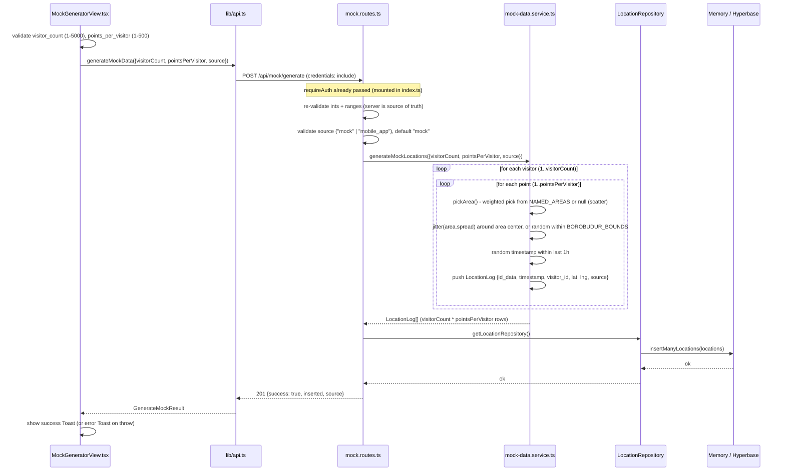
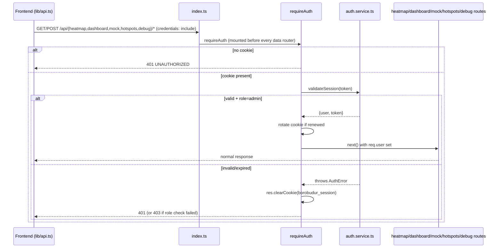

# Data Flows: Mock Generator & Auth

Detailed sequence diagrams for two flows that aren't fully spelled out in
`ARCHITECTURE.md`: the mock data generator (testing pipeline) and admin
authentication (session lifecycle).

## 1. Mock Generator

### 1.1 Bulk generate (`POST /api/mock/generate`)

Entry points: `MockGeneratorView.tsx` (admin UI) → `lib/api.ts` `generateMockData()` → backend `mock.routes.ts`.



Key details:
- **Distribution isn't uniform.** `pickArea()` does a cumulative-weight draw
  over `config/areas.ts` `NAMED_AREAS` (Main Stupa 45% / Entrance 25% / East
  Stairs 15% / West Area 10%), falling through to `null` (~5%) which scatters
  the point uniformly across `BOROBUDUR_BOUNDS` instead of clustering.
- **Jitter is cheap Gaussian-ish noise**: `(Math.random() + Math.random() - 1) * spread`
  — sum of two uniforms, not a real normal distribution, but close enough to
  avoid a hard-edged cluster.
- **Timestamps are backdated randomly within the last hour**, not all "now" —
  so generated batches immediately populate multiple time windows (5m/15m/1h)
  without waiting.
- **Validation happens twice**: once client-side in `MockGeneratorView.tsx`
  (UX — disables the button, shows "Values out of range"), once server-side
  in `mock.routes.ts` (security boundary — the client check is not trusted).
  The `MAX_VISITORS` / `MAX_POINTS` constants are duplicated in both files
  (frontend comment explicitly flags this: "Backend guard rails (mock.routes.ts)").
- **`source` is forced/whitelisted**, never arbitrary — only `"mock"` or
  `"mobile_app"` accepted, defaults to `"mock"`.
- Insert goes through the same `LocationRepository` interface as production
  data, so generated rows flow through the exact same aggregation/heatmap
  pipeline as real mobile-app data — that's the point of the mock generator
  (PRD goal #11: "test the full flow").

### 1.2 Single insert (`POST /api/mock/location`)

Simpler sibling endpoint, no UI wired to it yet: validates `visitor_id`,
`timestamp`, `latitude`, `longitude` individually, forces `source: "mock"`,
inserts one row. Used for manual/scripted testing (e.g. curl), not exposed
in `MockGeneratorView.tsx`.

## 2. Auth Flow

Admin-only auth, proxied through Hyperbase BaaS. Three lifecycle moments:
session bootstrap (app load), sign-in, and per-request validation.

### 2.1 Session bootstrap (on app mount)

```mermaid
sequenceDiagram
    participant App as App.tsx
    participant Ctx as context/auth.tsx (AuthProvider)
    participant Lib as lib/auth.ts
    participant Route as admin.routes.ts (GET /me)
    participant Mid as auth.middleware.ts (requireAuth)
    participant Svc as auth.service.ts
    participant HB as Hyperbase

    App->>Ctx: mount (status="loading")
    Ctx->>Lib: getMe()
    Lib->>Route: GET /api/auth/admin/me (cookie: borobudur_session)
    Route->>Mid: requireAuth
    Mid->>Svc: validateSession(jwt from cookie)
    Svc->>HB: POST /api/rest/auth/token (renew attempt, Bearer jwt)
    HB-->>Svc: {data:{token}} (fresh or same JWT) or failure (ignored, keep original)
    Svc->>Svc: decodeJwtPayload(token) - extract collection_id + record_id (unverified, safe because Hyperbase already validated)
    Svc->>HB: GET /collection/{collection_id}/record/{record_id} (service JWT)
    HB-->>Svc: {data: AdminUser}
    Svc->>Svc: check role === "admin", else throw 403
    Svc-->>Mid: {user, token}
    Mid->>Mid: if token !== original cookie, res.cookie() rotate
    Mid-->>Route: req.user set, next()
    Route-->>Lib: 200 {success:true, data:{_id,email,role}}
    Lib-->>Ctx: AuthUser
    Ctx->>Ctx: setUser(u); setStatus("authenticated")
    App->>App: render DashboardShell

    Note over Ctx,App: on any failure at any step, catch -> setStatus("unauthenticated") -> App renders LoginPage
```

### 2.2 Sign-in

```mermaid
sequenceDiagram
    participant Login as LoginPage.tsx
    participant Ctx as context/auth.tsx
    participant Lib as lib/auth.ts
    participant Route as admin.routes.ts (POST /signin)
    participant Svc as auth.service.ts (signinAdmin)
    participant HB as Hyperbase

    Login->>Ctx: signin(email, password)
    Ctx->>Lib: authApi.signin({email, password})
    Lib->>Route: POST /api/auth/admin/signin {email, password}
    Route->>Route: validate both present
    Route->>Svc: signinAdmin(email, password)
    Svc->>HB: POST /api/rest/auth/token-based {token_id, token, collection_id, data:{email,password}}
    HB-->>Svc: {data:{token}} or 401
    Svc-->>Route: jwt (or throws AuthError 401 "Invalid credentials")
    Route->>Route: res.cookie(borobudur_session, jwt, {httpOnly, secure(prod), sameSite:strict, maxAge:24h})
    Route-->>Lib: 200 {success:true, data:{email}}
    Lib-->>Ctx: {email}
    Ctx->>Lib: getMe() (fetch full profile right after cookie is set)
    Lib->>Route: GET /me (same validateSession path as 2.1)
    Route-->>Ctx: AuthUser
    Ctx->>Ctx: setUser(u); setStatus("authenticated")
    Ctx-->>Login: resolves -> App renders DashboardShell

    Note over Ctx,Login: on throw, Ctx sets error message, Login shows it, status stays "unauthenticated"
```

### 2.3 Per-request protection (every data route)



Notes:
- `/api/auth/*` itself is mounted **without** `requireAuth` (`index.ts:30`) —
  it handles its own checks per-route (`/me` uses `requireAuth` explicitly;
  `/signin`, `/signup`, `/logout` are intentionally public).
- The JWT is **decoded but never re-verified** in `validateSession` — this is
  safe only because the preceding `POST /api/rest/auth/token` renewal call to
  Hyperbase already validated signature/expiry; `decodeJwtPayload` just reads
  claims out of an already-trusted token.
- Role enforcement (`role !== "admin"` → 403) happens inside `validateSession`
  itself, not in a separate `requireRole` call on these routes — `requireRole`
  exists as a reusable primitive but isn't wired to any current route (all
  data routes accept any authenticated admin, since there's only one role).
- Cookie rotation is transparent to the client: if Hyperbase renews the JWT
  during validation, the middleware quietly re-sets the cookie on the same
  response — no separate refresh endpoint or client-side logic needed.
