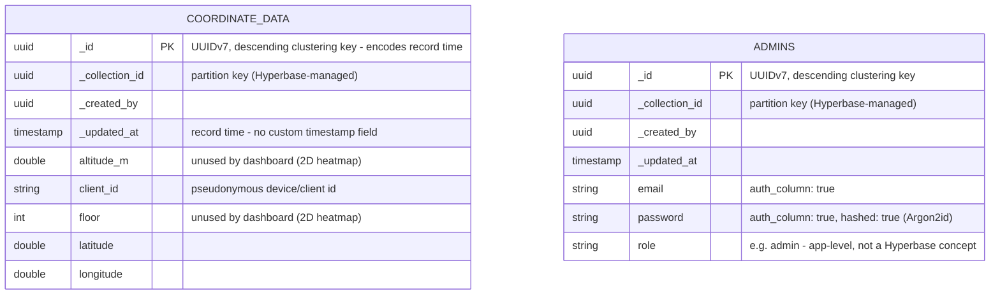
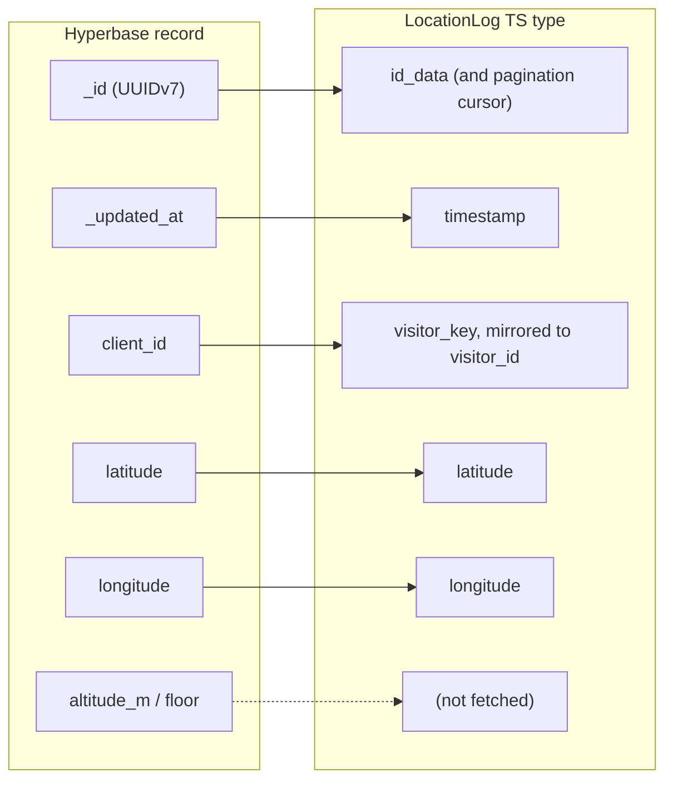

# Hyperbase Data Schema

Visual reference for the two Hyperbase collections this project depends on —
the mobile app's **`coordinate data`** collection (GPS ingestion) and the admin
auth collection (referenced as `HYPERBASE_AUTH_COLLECTION_ID`, provisioned as
`admins` or a patched `Users` collection — see `HYPERBASE_AUTH_INTEGRATION.md`
§4 "Provisioning Quirks"). The two collections live in **separate Hyperbase
projects** (location project vs auth project — see §6), one ScyllaDB-backed
physical table each.

> **Schema history:** early docs (`HYPERBASE_INTEGRATION.md` §5) specified a
> planned `location_logs` collection with custom `timestamp`, `visitor_key`,
> `id_data`, and `source` fields. That was a testing design — the real
> collection written by the Borobudur mobile app is `coordinate data` below,
> and the backend repository is mapped to it. This file is authoritative.

## 1. Entity-relationship view



`_collection_id` + `_id` form the ScyllaDB primary key on both physical
tables (`hyperbase.records_{collection_uuid_without_hyphens}`); Hyperbase
auto-injects `_id`, `_created_by`, `_updated_at` on every collection.

## 2. `coordinate data` — field detail

Collection ID example: `01999717-f4d5-7ed3-b511-efc297b4ca94` (goes in
`HYPERBASE_LOCATION_COLLECTION_ID`).

| Field        | Kind      | Used by dashboard | Notes |
|--------------|-----------|-------------------|-------|
| `_id`        | uuid      | **yes**           | UUIDv7 — high 48 bits are the unix-ms creation time, so it doubles as the time index; also the pagination cursor; mapped to internal `id_data` |
| `_updated_at`| timestamp | **yes**           | Record time — there is **no custom `timestamp` field**; mapped to internal `timestamp` |
| `altitude_m` | double    | no                | 2D heatmap ignores altitude |
| `client_id`  | string    | **yes**           | Pseudonymous device/client identifier — mapped to internal `visitor_key`/`visitor_id` for distinct counting; never exposed to the frontend (response types have no slot for it) |
| `floor`      | int       | no                | 2D heatmap ignores floors |
| `latitude`   | double    | **yes**           | |
| `longitude`  | double    | **yes**           | |

What the old testing schema had and this one doesn't:

- **No `source` column** — every row comes from the mobile app. The backend
  treats all Hyperbase rows as `source: "mobile_app"`; a `source=mock` query
  on the hyperbase driver short-circuits to an empty result, and the mock
  endpoints (`POST /api/mock/*`) return 400 on that driver (mock data is a
  memory-driver feature; there'd be no way to tell mock rows apart or delete
  them, and backdated timestamps are impossible since Hyperbase sets
  `_updated_at`).
- **No `id_data`** — `_id` serves as the record identifier.
- **No `visitor_key`** — `client_id` plays that role.

## 3. Admin auth collection — field detail

Not schema-locked in the docs the way the location collection is (provisioning
is manual/UI-driven), but must satisfy:

| Field      | Kind   | `auth_column` | `hashed` | Notes |
|------------|--------|----------------|----------|-------|
| `email`    | string | **true**       | false    | Login identifier |
| `password` | string | **true**       | **true** | Argon2id, hashed by Hyperbase on insert (static-salt limitation noted in the auth doc) |
| `role`     | string | false          | false    | App-level only — Hyperbase itself has no role concept; enforced in `validateSession` (`role !== "admin"` → 403) |

`auth_column: true` on `email`/`password` is load-bearing — Hyperbase's
`token-based` auth endpoint (`auth.rs`) specifically looks for those two
flags to know which fields to check during login.

## 4. Hyperbase record → internal type mapping



`HyperbaseLocationRepository` mirrors `client_id` into the in-process
`visitor_id` field so `dashboard.service.ts` can do one distinct-count
(`visitor_key ?? visitor_id`) regardless of which repository driver is
active — memory-seeded rows only ever have `visitor_id`, Hyperbase rows carry
`client_id`. Neither identifier appears on `HeatmapFeature`/GeoJSON — privacy
is enforced by that response type having no slot for it, not by a runtime
strip step. `source` is hardcoded to `"mobile_app"` for every Hyperbase row.

## 5. Query shape (read path)

There is no custom timestamp field to filter on, so time windows are expressed
as **UUIDv7 `_id` range bounds**: the repository synthesizes boundary UUIDs
whose high 48 bits are the window's unix-ms timestamps
(`TTTTTTTT-TTTT-7000-8000-000000000000`) with zeroed random bits, giving an
inclusive lower / exclusive upper bound on the clustering key itself.

Every `getLocations()` call becomes one `POST …/records`:

```json
{
  "fields": ["_id", "_updated_at", "client_id", "latitude", "longitude"],
  "filters": [{
    "op": "AND",
    "children": [
      { "field": "_id", "op": ">=", "value": "<uuidv7 bound of window start>" },
      { "field": "_id", "op": "<",  "value": "<uuidv7 bound of window end>" }
    ]
  }],
  "limit": 500
}
```

Pagination **tightens the upper bound** instead of adding a second filter:
each next page replaces the `<` value with the last `_id` seen (records are in
descending `_id` order), repeating until a short page signals the end. This
keeps a single `<` restriction per query — ScyllaDB rejects two range
restrictions on the same column.

## 6. Environment variables → schema identifiers

The location and auth collections live in **separate Hyperbase projects**, so
each side has its own project/token vars. The `HYPERBASE_AUTH_*` connection
vars fall back to the location values when empty (single-project setups need
nothing extra), but Hyperbase tokens are project-scoped — a different auth
project needs its own token id/secret.

| Env var                              | Points at |
|---------------------------------------|-----------|
| `HYPERBASE_BASE_URL` / `HYPERBASE_PROJECT_ID` | Location project (holds `coordinate data`) |
| `HYPERBASE_LOCATION_COLLECTION_ID`    | `coordinate data` collection UUID (e.g. `01999717-f4d5-7ed3-b511-efc297b4ca94`) |
| `HYPERBASE_TOKEN_ID` / `_TOKEN_SECRET`| Location project's service token, scoped to the coordinate collection (`allow_anonymous = true`); read-only from the dashboard's perspective — `insert_one` can be `false` |
| `HYPERBASE_AUTH_BASE_URL` / `HYPERBASE_AUTH_PROJECT_ID` | Auth project (holds the admin collection); empty → falls back to location values |
| `HYPERBASE_AUTH_TOKEN_ID` / `_AUTH_TOKEN_SECRET` | Auth project's service token (needs `insert_one` for signup + record read for session validation); empty → falls back to location token |
| `HYPERBASE_AUTH_COLLECTION_ID`        | Admin collection UUID (`admins` or patched `Users`) |
| `ADMIN_REGISTRATION_SECRET`           | Gates `POST /api/auth/admin/signup` — not a Hyperbase concept, app-level only |
