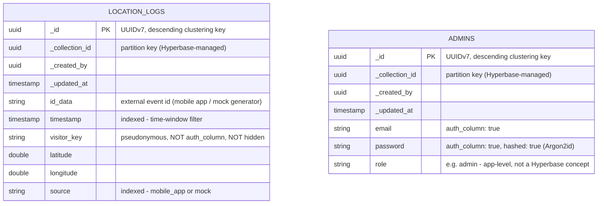
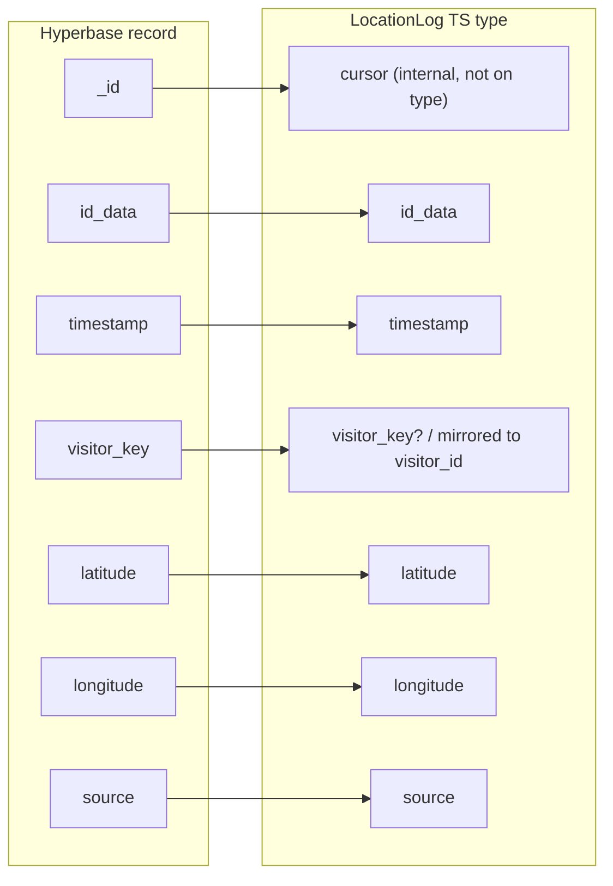

# Hyperbase Data Schema

Visual reference for the two Hyperbase collections this project depends on —
`location_logs` (GPS ingestion) and the admin auth collection (referenced as
`HYPERBASE_AUTH_COLLECTION_ID`, provisioned as `admins` or a patched `Users`
collection — see `HYPERBASE_AUTH_INTEGRATION.md` §4 "Provisioning Quirks").
Both live in one Hyperbase project, one ScyllaDB-backed physical table each.

## 1. Entity-relationship view



`_collection_id` + `_id` form the ScyllaDB primary key on both physical
tables (`hyperbase.records_{collection_uuid_without_hyphens}`); Hyperbase
auto-injects `_id`, `_created_by`, `_updated_at` on every collection.

## 2. `location_logs` — field detail

| Field         | Kind        | Required | Indexed | Hidden | Notes |
|---------------|-------------|----------|---------|--------|-------|
| `id_data`     | string      | yes      | no      | no     | External event ID from mobile app / mock generator |
| `timestamp`   | timestamp   | yes      | **yes** | no     | RFC 3339; drives time-window filters (`>=`/`<` on this field) |
| `visitor_key` | string      | yes      | no      | **no** | Pseudonymous visitor ID — deliberately **not** `hidden: true` (hidden fields are omitted from token-based responses entirely, which would break internal distinct-visitor counting); privacy is enforced by response *types* in the Express layer instead, not by Hyperbase |
| `latitude`    | double      | yes      | no      | no     | |
| `longitude`   | double      | yes      | no      | no     | |
| `source`      | string      | yes      | **yes** | no     | `"mobile_app"` \| `"mock"` — indexed because every query filters on it |

Collection rule for the service token (least privilege — no direct reads):

```json
{ "find_one": "none", "find_many": "all", "insert_one": true, "update_one": "none", "delete_one": "none" }
```

## 3. Admin auth collection — field detail

Not schema-locked in the docs the way `location_logs` is (provisioning is
manual/UI-driven), but must satisfy:

| Field      | Kind   | `auth_column` | `hashed` | Notes |
|------------|--------|----------------|----------|-------|
| `email`    | string | **true**       | false    | Login identifier |
| `password` | string | **true**       | **true** | Argon2id, hashed by Hyperbase on insert (static-salt limitation noted in the auth doc) |
| `role`     | string | false          | false    | App-level only — Hyperbase itself has no role concept; enforced in `validateSession` (`role !== "admin"` → 403) |

`auth_column: true` on `email`/`password` is load-bearing — Hyperbase's
`token-based` auth endpoint (`auth.rs`) specifically looks for those two
flags to know which fields to check during login.

## 4. Hyperbase record → internal type mapping



`HyperbaseLocationRepository` mirrors `visitor_key` into the in-process
`visitor_id` field so `dashboard.service.ts` can do one distinct-count
(`visitor_key ?? visitor_id`) regardless of which repository driver is
active — memory-seeded rows only ever have `visitor_id`, Hyperbase rows only
ever have `visitor_key`. Neither field appears on `HeatmapFeature`/GeoJSON —
privacy is enforced by that response type having no slot for it, not by a
runtime strip step.

## 5. Query shape (read path)

Every `getLocations()` call becomes one `POST …/records` with an `AND` filter
group — always time-bounded, always page-capped:

```json
{
  "fields": ["_id", "id_data", "timestamp", "visitor_key", "latitude", "longitude", "source"],
  "filters": [{
    "op": "AND",
    "children": [
      { "field": "timestamp", "op": ">=", "value": "<window start>" },
      { "field": "timestamp", "op": "<",  "value": "<window end>" },
      { "field": "source",    "op": "=",  "value": "mock" }
    ]
  }],
  "limit": 500
}
```

Pagination adds `{ "field": "_id", "op": "<", "value": "<last _id>" }` to the
same `AND` group and repeats until a short page signals the end. ScyllaDB
reads here use `ALLOW FILTERING` (acceptable only because every query is
time-bounded and page-capped — see `HYPERBASE_INTEGRATION.md` §3.2).

## 6. Environment variables → schema identifiers

| Env var                              | Points at |
|---------------------------------------|-----------|
| `HYPERBASE_PROJECT_ID`                | The one Hyperbase project holding both collections |
| `HYPERBASE_LOCATION_COLLECTION_ID`    | `location_logs` collection UUID |
| `HYPERBASE_AUTH_COLLECTION_ID`        | Admin collection UUID (`admins` or patched `Users`) |
| `HYPERBASE_TOKEN_ID` / `_TOKEN_SECRET`| Service token scoped to `location_logs` only (`allow_anonymous = true`) |
| `ADMIN_REGISTRATION_SECRET`           | Gates `POST /api/auth/admin/signup` — not a Hyperbase concept, app-level only |
