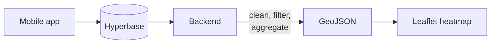

# Borobudur Aggregated Heatmap Dashboard

A web dashboard that shows how visitors are spread across Borobudur temple.

A mobile app records visitor GPS points into Hyperbase, a Backend-as-a-Service
built on ScyllaDB. The backend reads those points, throws out the invalid ones
and anything outside the temple grounds, counts what is left into a fixed grid,
and serves the grid as GeoJSON. The frontend polls that GeoJSON and draws it as
a Leaflet heatmap.

Only grid cells leave the backend — never an individual visitor's points, and
never a `visitor_id`. The response types have no field for it, so privacy holds
by construction rather than by policy.

Live on the campus server. Status: built and running.

---

## Start here

- :material-file-document-outline: **[Project Blueprint](BLUEPRINT.md)**

    The full account — background, goals, scope, design, implementation,
    testing, and status. **Read this first.**

- :material-api: **[API Reference](API.md)**

    The binding contract for every endpoint: parameters, response shapes,
    error codes.

- :material-sitemap-outline: **[Architecture](ARCHITECTURE.md)**

    Backend layers, the repository pattern, and the data flow — in two pages.

- :material-server-network: **[Deployment](DEPLOYMENT.md)**

    Docker Compose topology, environment template, and verification steps.

---

## How the data moves

---

## Tech stack

| Layer | Technology |
|---|---|
| Frontend | React 18, Vite 6, TypeScript, Tailwind CSS v4, Leaflet + `leaflet.heat`, Recharts |
| Backend | Node.js, Express 4, TypeScript, Swagger (OpenAPI 3.0.3) |
| Location data | Hyperbase — a BaaS on top of ScyllaDB |
| Authentication | PostgreSQL, bcrypt, JWT in an `httpOnly` cookie |
| Machine learning | DBSCAN, running in the backend in TypeScript |
| Deployment | Docker Compose, nginx, Cloudflare Tunnel |

No map token is needed. Tiles are standard OpenStreetMap, with Esri World
Imagery satellite as an opt-in layer.

!!! note "About the Archive section"
    Pages under **Archive** in the sidebar are superseded or finished work,
    kept for history. Each one opens with a banner saying what replaced it.
    Nothing there describes the system as it runs today.
